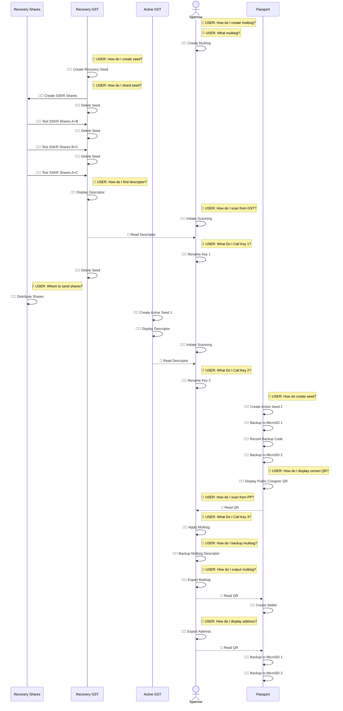

# Complete Sequence Diagram for Classic Multisig Scenario

```mermaid
sequenceDiagram
participant Rs as Recovery Shares
participant R as Recovery GST
participant S1 as Active GST
actor TC as Sparrow
participant S2 as Passport

note right of TC: 🧠 USER: How do I create multisig?
note right of TC: 💡 USER: What multisig?
TC->>TC: 🙎🏽 Create Multisig

note right of R: 🧠 USER: How do I create seed?
R->>R: 🙎🏽 Create Recovery Seed
note right of R: 🧠 USER: How do I shard seed?
R->>Rs: 🙎🏽 Create SSKR Shares
R->>R: 🙎🏽 Delete Seed
Rs->>R: 🙎🏽 Test SSKR Shares A+B
R->>R: 🙎🏽 Delete Seed
Rs->>R: 🙎🏽 Test SSKR Shares B+C
R->>R: 🙎🏽 Delete Seed
Rs->>R: 🙎🏽 Test SSKR Shares A+C

note right of R: 🧠 USER: How do I find descriptor?
R->>R: 🙎🏽 Display Descriptor
note right of TC: 🧠 USER: How do I scan from GST?
TC->>TC: 🙎🏽 Initiate Scanning
R-->>TC: 🤖 Read Descriptor
note right of TC: 💡 USER: What Do I Call Key 1?
TC->>TC: 🙎🏽 Rename Key 1
R->>R: 🙎🏽 Delete Seed
note right of Rs: 💡 USER: Where to send shares?
Rs->>Rs: 🙎🏽 Distribute Shares

S1->>S1: 🙎🏽 Create Active Seed 1
S1->>S1: 🙎🏽 Display Descriptor
TC->>TC: 🙎🏽 Initiate Scanning
S1-->>TC: 🤖 Read Descriptor
note right of TC: 💡 USER: What Do I Call Key 2?
TC->>TC: 🙎🏽 Rename Key 2

note right of S2: 🧠 USER: How do create seed?
S2->>S2: 🙎🏽 Create Active Seed 2
S2->>S2: 🙎🏽 Backup to MicroSD 1
S2->>S2: 🙎🏽 Record Backup Code
S2->>S2: 🙎🏽 Backup to MicroSD 2
note right of S2: 🧠 USER: How do I display correct QR?
S2->>S2: 🙎🏽 Display Public Cosigner QR
note right of TC: 🧠 USER: How do I scan from PP?
S2-->>TC: 🤖 Read QR
note right of TC: 💡 USER: What Do I Call Key 3?

TC->>TC: 🙎🏽 Apply Multisig
note right of TC: 🧠 USER: How do I backup multisig?

TC->>TC: 🙎🏽 Backup Multisig Descriptor
note right of TC: 🧠 USER: How do I output multisig?
TC->>TC: 🙎🏽 Export Multisig
TC-->>S2: 🤖 Read QR
S2->>S2: 🙎🏽 Create Wallet
note right of TC: 🧠 USER: How do I display address?
TC->>TC: 🙎🏽 Export Address
TC-->>S2: 🤖 Read QR
S2->>S2: 🙎🏽 Backup to MicroSD 1
S2->>S2: 🙎🏽 Backup to MicroSD 2
```
