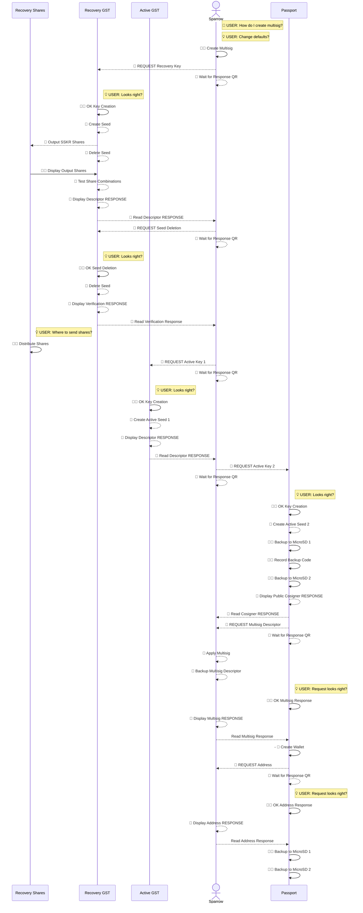

# Complete Sequence Digram for Request/Response Scenario

```mermaid
sequenceDiagram
participant Rs as Recovery Shares
participant R as Recovery GST
participant S1 as Active GST
actor TC as Sparrow
participant S2 as Passport

note right of TC: 🧠 USER: How do I create multisig?
note right of TC: 💡 USER: Change defaults?
TC->>TC: 🙎🏽 Create Multisig

TC-->>R: 🤖 REQUEST Recovery Key
TC-->>TC: 🤖 Wait for Response QR

note right of R: 💡 USER: Looks right?
R->>R: 🙎🏽 OK Key Creation
R-->>R: 🤖 Create Seed
R-->>Rs: 🤖 Output SSKR Shares
R-->>R: 🤖 Delete Seed
Rs->>R: 🙎🏽 Display Output Shares
R-->>R: 🤖 Test Share Combinations
R-->>R: 🤖 Display Descriptor RESPONSE
R-->>TC: 🤖 Read Descriptor RESPONSE

TC-->>R: 🤖 REQUEST Seed Deletion
TC-->>TC: 🤖 Wait for Response QR
note right of R: 💡 USER: Looks right?
R->>R: 🙎🏽 OK Seed Deletion
R-->>R: 🤖 Delete Seed
R-->>R: 🤖 Display Verification RESPONSE
R-->>TC: 🤖 Read Verification Response
note right of Rs: 💡 USER: Where to send shares?
Rs->>Rs: 🙎🏽 Distribute Shares

TC-->>S1: 🤖 REQUEST Active Key 1
TC-->>TC: 🤖 Wait for Response QR
note right of S1: 💡 USER: Looks right?
S1->>S1: 🙎🏽 OK Key Creation
S1-->>S1: 🤖 Create Active Seed 1
S1-->>S1: 🤖 Display Descriptor RESPONSE
S1-->>TC: 🤖 Read Descriptor RESPONSE

TC-->>S2: 🤖 REQUEST Active Key 2
TC-->>TC: 🤖 Wait for Response QR
note right of S2: 💡 USER: Looks right?
S2->>S2: 🙎🏽 OK Key Creation
S2-->>S2: 🤖 Create Active Seed 2
S2->>S2: 🙎🏽 Backup to MicroSD 1
S2->>S2: 🙎🏽 Record Backup Code
S2->>S2: 🙎🏽 Backup to MicroSD 2
S2-->>S2: 🤖 Display Public Cosigner RESPONSE
S2-->>TC: 🤖 Read Cosigner RESPONSE
S2-->>TC: 🤖 REQUEST Multisig Descriptor
S2-->>S2: 🤖 Wait for Response QR

TC-->>TC: 🤖 Apply Multisig
TC-->>TC: 🤖 Backup Multisig Descriptor

note right of S2: 💡 USER: Request looks right?
S2->>S2: 🙎🏽 OK Multisig Response
TC-->>TC: 🤖 Display Multisig RESPONSE
TC-->>S2: Read Multisig Response
S2->>S2:- 🤖 Create Wallet
S2-->>TC: 🤖 REQUEST Address
S2-->>S2: 🤖 Wait for Response QR

note right of S2: 💡 USER: Request looks right?
S2->>S2: 🙎🏽 OK Address Response
TC-->>TC: 🤖 Display Address RESPONSE
TC-->>S2: Read Address Response
S2->>S2: 🙎🏽 Backup to MicroSD 1
S2->>S2: 🙎🏽 Backup to MicroSD 2
```
