# Improving Multisigs with Request/Response

#### A Use Case for Gordian Envelope's Request/Response

[Smart Custody](https://www.smartcustody.com/) has been a strong focus of Blockchain Commons since its earliest days due to its promotion of independence, privacy, and resilience, which are [Gordian Principles](https://developer.blockchaincommons.com/principles/). The [2019 Smart Custody book](https://www.smartcustody.com/index.html#the-book) described a single-signature self-sovereign custody solution for digital assets, but within a few years the Bitcoin ecosystem had advanced enough that multisigs could be created with high-quality open-source wallets such as [Sparrow](https://sparrowwallet.com/). Blockchain Commons' [Multisig Self-Custody Scenario](https://github.com/BlockchainCommons/SmartCustody/blob/master/Docs/Scenario-Multisig.md) thus debuted in 2022 and demonstrated how to protect self-sovereign digital assets more robustly by creating a multisig. With a transaction coordinator, two signing devices, and one recovery device, digital assets were simultaneously protected from theft and accidental loss.

Unfortunately, setting up a multisig with a Multisig Self-Custody Scenario is complex and requires a fair amount of user knowledge about all the devices involved. It's not just that it was inaccessible to a casual user: it was inaccessible to all but the most experienced _and_ dedicated users. We _know_ that [Process Fatigue](https://github.com/BlockchainCommons/SmartCustodyBook/blob/master/manuscript/03-adversaries.md#adversary-process-fatigue) and a desire for [Convenience](https://github.com/BlockchainCommons/SmartCustodyBook/blob/master/manuscript/03-adversaries.md#adversary-convenience) are real Adversaries that oppose the Smart Custody of digital assets. As a result, many users weren't willing to use the Multisig Self-Custody Scenario in this Classic configuration. 

This is why new technological solutions are needed. A new methodology is required that not only _enables_ the use of multisigs but also _simplifies_ and _automates_ the process of creating them. If a user can click "Create Multisig" on their transaction coordinator and then simply follow instructions and click confirmations then they are _much_ more likely to adopt a multisig asset-protection methodology than if they must connect together all the pieces by hand. 

This is the new methodology laid out here by the Request/Response Multisig Self-Custody Scenario. It is a superior answer to the problem of self-custody that also demonstrates the needs for the capabilities of [Gordian Envelope](https://developer.blockchaincommons.com/envelope/), especially its [Request/Response system](https://developer.blockchaincommons.com/envelope/request/). This Scenario uses these Requests and Responses to create a linear progression that guides users across the creation of a multisig, minimizing the need for user research, decision, or interaction. This both reduces the possibility of user errors and increases user willingness to engage in a more resilient self-custody solution, overall increasing the success of the digital-asset space.

_This article demonstrates both the Classic Multisig Self-Custody Scenario and the new Request/Response Multisig Self-Custody Scenario using sequence diagrams to clearly demonstrate the advantages of using Envelopes. Neither example shows entirely physical interactions, such as distributing data storage methods to different vaults, nor setup steps for any of the software or hardware. These examples may also miss minor actions or decisions. (Overall, both of these scenarios are likely even more complex than they seem.) However, both examples should be abstracted to the same level, to provide a clear apples-to-apples comparison, which is the main goal._

## Classic Self-Sovereign Multisig Scenario

Following is a sequence diagram of the classic design of a multisig solution detailed in [Multisig Self-Custody Scenario](https://github.com/BlockchainCommons/SmartCustody/blob/master/Docs/Scenario-Multisig.md), which makes use of current best-in-class transaction coordinator capabilities found in Sparrow Wallet. 

**Multisig Prep:**

The initial setup is simple enough, and that's the way it should work for a digital-asset scenario: the user should know a little bit, make a few decisions, then activate the system.

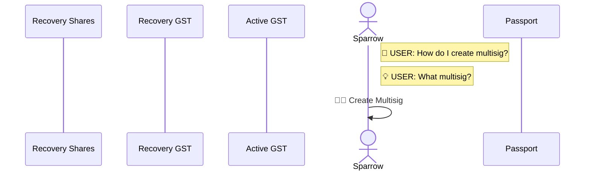

**Recovery Key (GST) Creation & Input:**

In the Multisig Self-Custody system, when you jump over to the Recovery Key (or really, any of the Keys), things get complex. It's not just that a user has to effectively start over on this new device, but they need to know everything about how it works and to initiate numerous actions.

**Active Key #1 (GST) Creation & Input:**

In the Multisig Self-Custody system, Active Key #1 is then pretty easy to create, but that's solely because it uses the same codebase as the Recovery Key: Gordian Seed Tool. This was a self-imposed limitation of the scenario, which focused on very robust seed storage, but a multisig system ready for deployment should really use three different codebases for its seed storage, which would make this second key's creation as complex as any of the others.

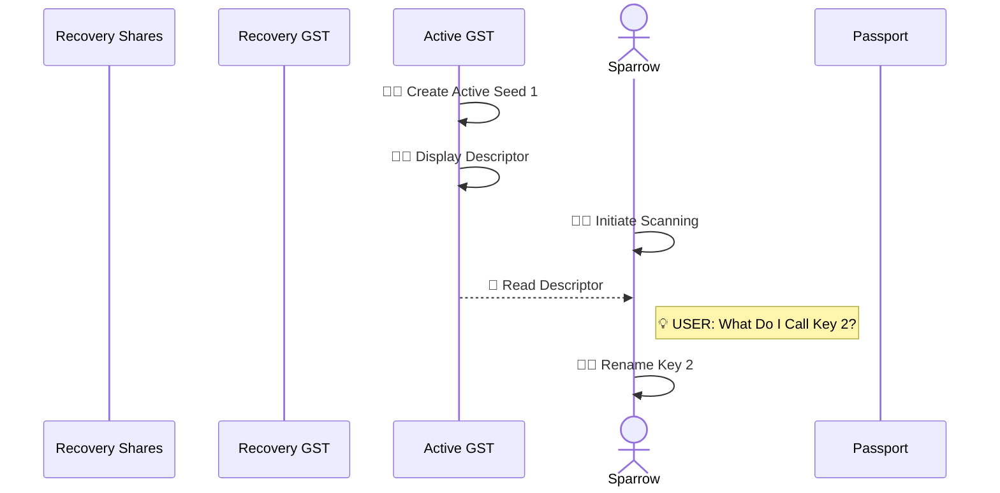

**Active Key #2 (Passport) Creation & Input:**

In the Multisig Self-Custody system, Active Key #2, which is generated on a Passport, has different complexities than the first, related to backups and the fact that additional finalization has to be done _after_ the multisig is created. But the notable thing here is that the user has to (again) learn a whole different system.

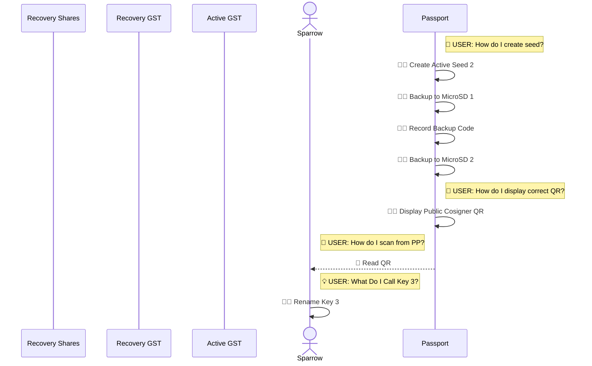

**Multisig Finalization:**

The multisig finalization is just as simple as the initial setup.

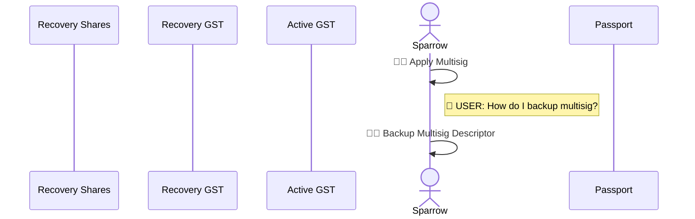

**Active Key #2 (Passport) Finalization:**

But to finalize the Passport key requires even more work (though it's definitely for a good cause, as Passport maintains its own copy of the multisig output descriptor, does an extra verification step, and encourages the user to update their backups).

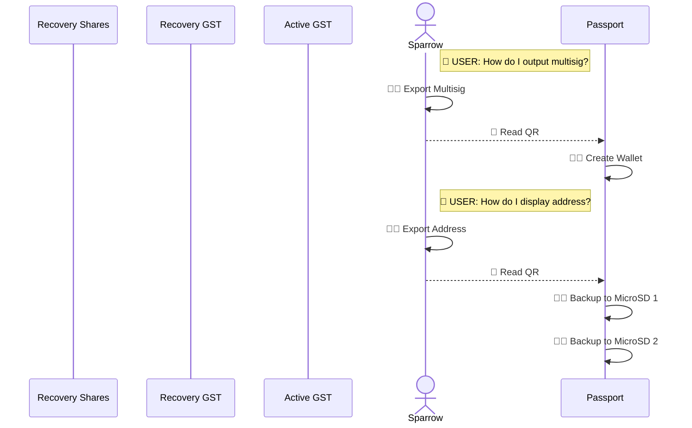

**Classic Scenario Overview:**

Overall, this abstraction of the current Multisig Self-Custody scenario demonstrates the following steps:

* **5 Decision Points (💡).** _When a user must make a decision._ Obviously, a user will have to make decisions in a process, but complex decisions are spread across the whole system (and all of the renaming of the keys wouldn't be necessary if the transaction coordinator could just learn more about the seed vaults it's working with).
* **11 Research Points (🧠).** _When a user must figure out how to do something._ A user shouldn't have to figure out all of the intricacies of each of his signing devices. Instead, they should be cleanly interoperable: once a user figures out how to start a process, it should continue straight through without more learning required. The cognitive load of continued education needed is likely the biggest thing holding back usage of a multisig scenario (or many other somewhat complex digital-asset tasks). 
* **30 Human Actions (🙎🏽).** _When a user must intiate an action._ Having to actively continue the process 30 times, in a wide variety of ways (while also requiring constant reference to the Scenario checklist), might be another show stopper, especially when that's on-top of physical activities such as storing things in different places.
* **5 Automated Actions (🤖).** _When the interopable process initiates an action on its own._ In the Classic Multisig Self-Custody Scenario, Automated Actions are limited to those times when one device has been setup to display a QR and another to read a QR. Only when both of these Human Actions have occurred does an Automated Action (briefly) continue.

The imbalance of Research Points (11 🧠) and Human Actions (30 🙎🏽) to Automated Actions (5 🤖) is clearly the heart of the problem with the currently possible Multisig Self-Custody Scenario. But there are at least two other issues:

* **No Linear Progression.** There isn't a clear progression for the process, other than following the checklists in the detailed [Multisig Self-Custody Scenario](https://github.com/BlockchainCommons/SmartCustody/blob/master/Docs/Scenario-Multisig.md). And that still requires jumping all around in the physical world. A user sets up things on the transaction coordinator, and then has to know to jump to another device before finally reading back into the transaction coordinator. Without the written scenario (and based on our tests, sometimes even with it), the user is lost.
* **No Metadata.** A lack of metadata means that no device ever knows what other device it's communicating with. As a result, the user constantly needs to tell the transaction coordinator exactly what device it's going to read from and even afterward they have to make changes like renaming keys.

[See a diagram of the whole "Classic Scenario" process.](Scenario-Multisig-RR-Classic.md)

## Request/Response Multisig Self-Sovereign Scenario

Blockchain Commons' forwarding-look Request-Response Scenario use case is a simple adaptation of the Classic Scenario that's meant to solve these problems primarily through the application of [Gordian Envelopes](https://developer.blockchaincommons.com/envelope/). These Envelopes allow the transaction coordinator to actually coordinate: it starts the multisig-creation process and then initiates conversation with each seed vault in turn, as demonstrated in the sequence diagrams below.

Envelopes solve the problems of the Classic scenario via two main means:

* **Request/Response.** Gordian Envelopes have a [Request/response system](https://developer.blockchaincommons.com/envelope/request/) that allow devices to send each other function calls remotely. Currently, request/response supports calls to send seeds, send keys, send output descriptors, and sign PSBTs. This scenario imagines new request/response calls  that would be trivial to add to create recovery seeds, create active seeds, delete seeds, send remote addresses, and send remote multisig descriptors. Through the use of request/response, this scenario creates a linear progression that at _every_ step across multiple devices prompts a user with what to do next, greatly simplifying the multisig setup (and removing the need for a written scenario).
* **Metadata.** Envelopes can carry arbitrary metadata alongside their payload. This resolves the other major problem with the Classic Scenario, where even when QR codes transmitted data from one device to another, there was still no ability for the transaction coordinator to view the larger picture (for example, what device it was working with, and what notes or other data the device might have about the seed being used to generate a key).

With a Request/Response scenario:

1. The user makes initial decisions about multisig creation.
2. The user follows the instructions on various devices, trading between them as instructed.
3. The user confirms each Request as it's read into another device.
4. The user takes care of physical chores.
5. The devices do the rest.

Thanks to linear progression and the transmission of metadata saying what each device is and what it did, the procedure is laid out for the user rather than the user needing to lay it out themself from a checklist and the probability of users engaging in a Smart Custody solution such as a multisig is dramatically increased.

_As noted, this Request/Response scenario is simply an adaptation of the Classic scenario: a scenario built from the ground up to use Request/Response could enjoy even greater improvements._

**Multisig Prep:**

The prep is very similar to the prep in the Classic Scenario, except here a user will preload all their major choices for the entire scenario by choosing how to create their multisig and with what devices. From there, the transaction coordinator will be able to use Requests and Responses to walk through the entire process.

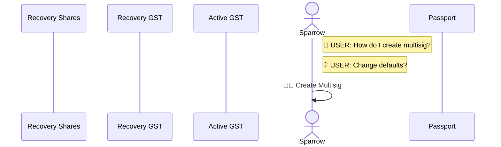

**Recovery Key (GST) Creation & Input:**

The standard procedure for a Request/Response interaction between the transaction coordinator and a seed-vault device is as follows:

1. The transaction coordinator makes a Request.
2. The transaction coordinator begins waiting for a Response.
3. The user reads the Request with the remote device.
4. The user Confirms the Request on the remote device.
5. The remote device does its stuff.
6. The remote device displays a Response.
7. The user reads the Response with the transaction coordinator.

Obviously, there's the opportunity for more human interaction at each step, depending on the exact needs on the device. In the case of a recovery key generated by Gordian Seed Tool, the Seed Vault creates SSKR shares and then the user will have to read them back into the device, and down the road they'll have to figure out how to distribute them. But, those human interactions are minimized to these activities requiring _physical_ intervention of some sort (as well as the [best practice](https://developer.blockchaincommons.com/envelope/request/#best-practices-for-request--response) of Confirming Requests).

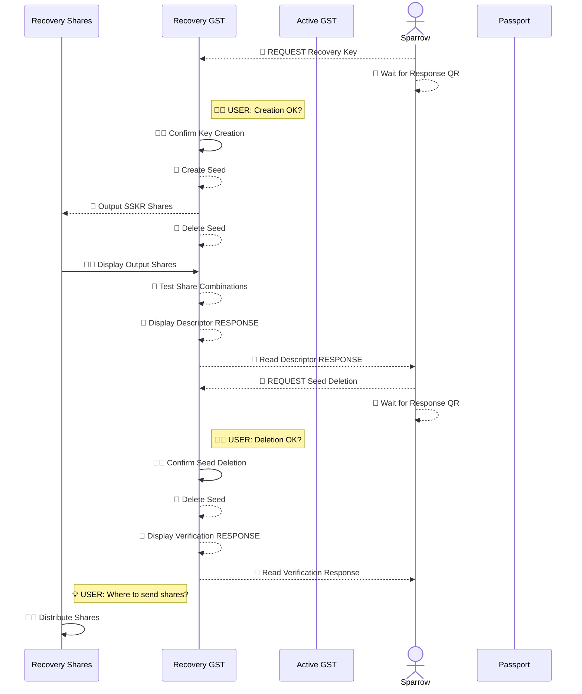

**Active Key #1 (GST) Creation & Input:**

In the simplest situation, all a user has to do is OK the remote activity on the seed vault. The devices and the Request/Response system take care of the rest.

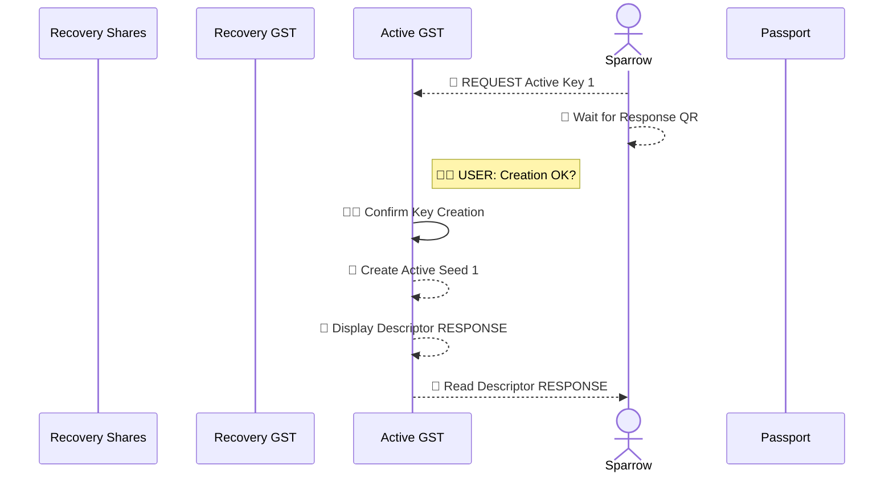

**Active Key #2 (Passport) Creation & Input:**

The Passport hardware wallet offers another example where a bit of physical interaction is still required, here to insert the two MicroSDs into the Passport for backup and to physically record a backup code. 

(Could the backup code be recorded by the transaction coordinator using metadata? This is one of the situations where a new scenario built from the ground up to use Request/Response could show additional improvement. A Passport backup code could be stored safely and securely by putting it in an Envelope, sharding it, and storing those shares on the transaction coordinator and the other two devices. But to mirror the original scenario, this updates simply assumes user recording, as before.)

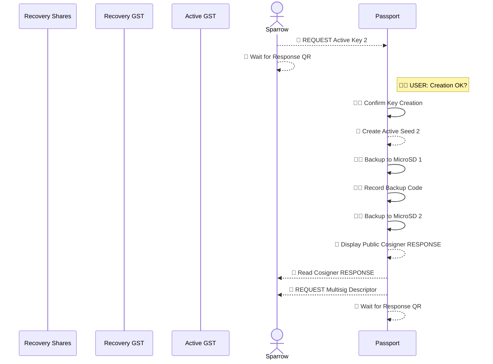

**Multisig Finalization:**

As usual the finalization of the multisig on the transaction coordinator is simple.

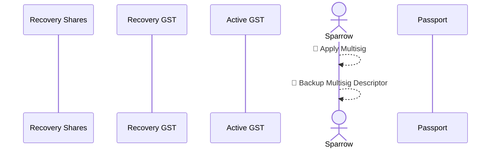

**Active Key #2 (Passport) Finalization:**

However, there was a bit of a twist at the end of the Passport Active Key creation. After sending the Response to the transaction coordinator, the Passport then created a new Request: "🤖 REQUEST Multisig Descriptor". This previously required more human intervention for the user to find the data that the Passport wanted. Now, after the multisig is created, the user just shows the transaction coordinator the new Request from the Passport, and afterward the two devices can iterate through the Passport's final data acquisition.

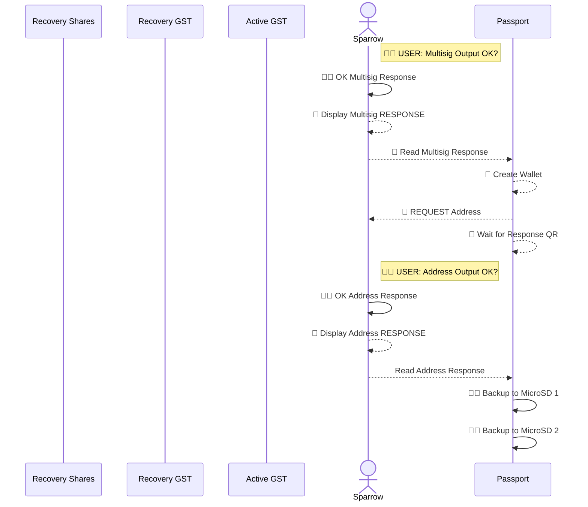

**Request/Response Scenario Overview:**

The Classic Scenario, updated with Request/Response, includes the following steps:

* **2 Decision Point (💡).** _When a user must make a decision._ There are a mere two decision points in the new scenario: how to set up the multisig (including what devices to use) and how to distribute shares. This means that a user is less likely to get stuck in the middle of a scenario and give up, because they'll have planned out all the core things in advance.
* **6 Confirmation Points (👍🏽).** _When a user confirms a decision._ Blockchains Commons [best practices](https://developer.blockchaincommons.com/envelope/request/#best-practices-for-request--response) for use of Request/Response suggest confirming each Request (unless some sort of preconfirmation has been made). This introduces new points of human intervention, but ones that are both necessary (because they check the automated process so it doesn't run out of control) and simple (because they only require looking at information and OKing it). 
* **1 Research Point (🧠).** _When a user must figure out how to do something._ An even bigger advantage is obvious in the Reseach Points: a user only has to figure out one thing; Request/Response takes care of the rest. 
* **14 Human Actions (🙎🏽).** _When a user must intiate an action._ The Human Actions are halved. Even then, half of the remaining actions are just an OK of a Confirmation Point. The other half are physical interactions, but all are now guided by the devices as they step through the procedure using Request/Response codes, so they're simple and obvious. (Exact gains here depend on the precise needs of the devices being uses.)
* **32 Automated Actions (🤖).** _When the interopable process initiates an action on its own._ Obviously, Automated Actions take up the slack, and this is the great advantage of a Request/Response system: Automated Actions (and even Human Actions) driven by an automated procedure and human confirmations.

[See a diagram of the whole "Request/Response Scenario" process.](Scenario-Multisig-RR-Updated.md)

**Scenario Comparison:**

Here's the comparison in pure numbers, which doesn't reflect the fact that the decisions and actions in the Request/Response Scenario are mostly binary decisions, confirmation inputs, and instructed actions, all decreasing the cognitive load.

| | Classic | R/R |
|---|-------|-----|
| Decision Points (💡) | 5 | 2 |
| Confirmation Points (👍🏽) | 0 | 6 |
| Research Points (🧠) | 11 | 1 |
| Human Actions (🙎🏽) | 30 | 14 |
| Automated Actions (🤖) | 5 | 32 | 

## Final Notes

Even with sophisticated transaction coordinators such as Sparrow, current multisig scenarios are a hodge-podge. They're complex and they involve high amounts of human decision, research, and intervention. As a result, they're not used and digital assets remain insecure.

This is one of the primary use cases for Gordian Envelope, especially its [Request/Response functionality](https://developer.blockchaincommons.com/envelope/request/) and its ability to encode metadata. Together these abilities create a new paradigm of not just interoperability (where different devices are able to talk to each other) but _interfunctionality_ (where different devices are able to work together as a cohesive whole). 

_If you are a wallet developer and you are interested in introducing these improvements to the flow of your hardware or software wallet, please get in touch with us. Join the [Gordian Developers announcements list or Signal group](https://www.blockchaincommons.com/subscribe/) so that you can receive the info to attend our monthly Gordian Developer meetings (on the first Wednesday of each month) or [email us directly](mailto:team@blockchaincommons.com)._

_If you're another party who believes that multisigs and their resilience are important for the self-sovereign control of digital assets, please [become a patron](https://github.com/sponsors/BlockchainCommons) and/or support the [wallet vendors and other companies](https://www.blockchaincommons.com/sponsors/) that support us._
