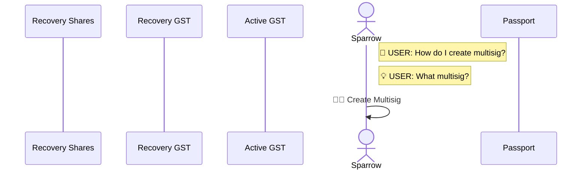
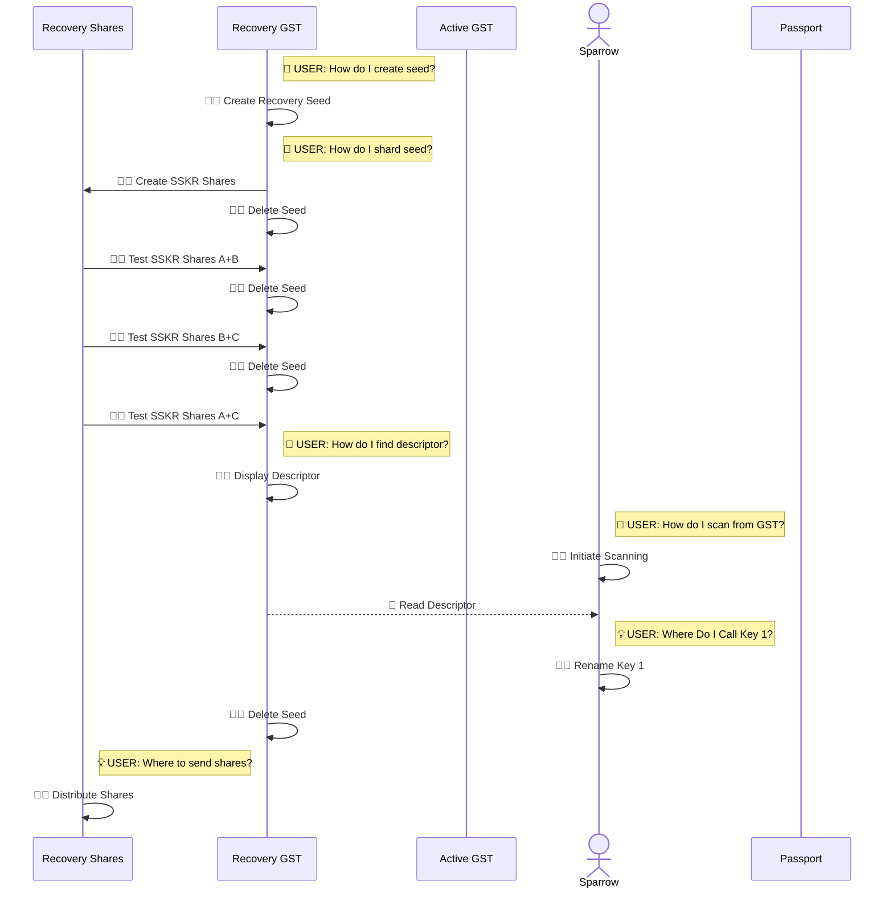
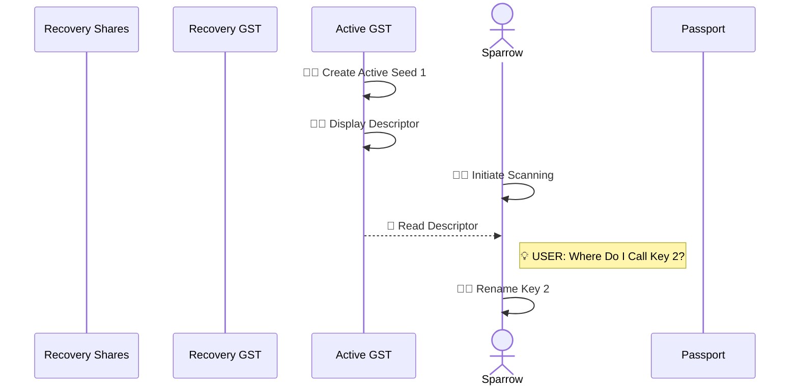
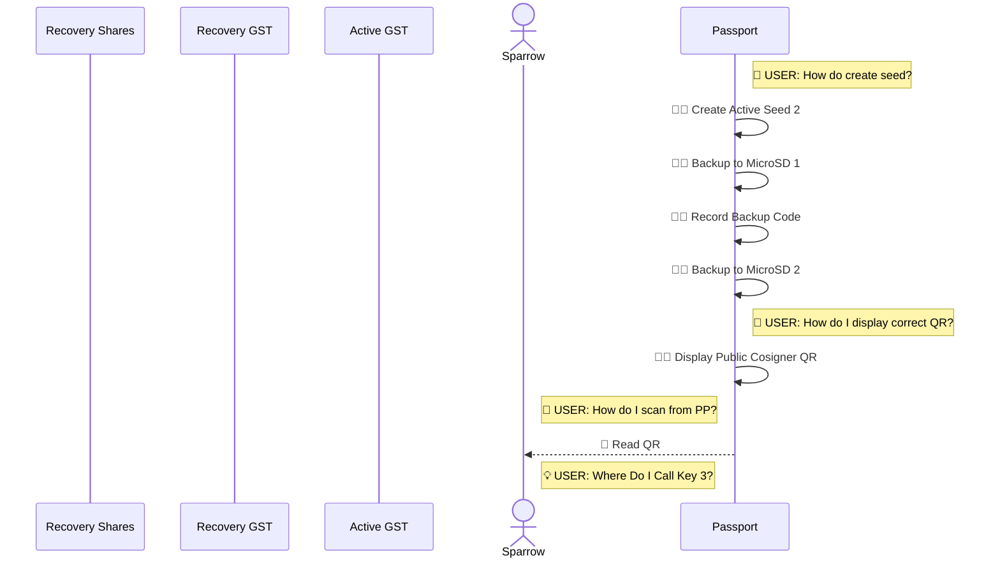
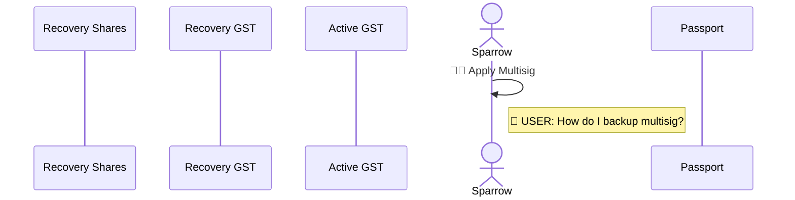
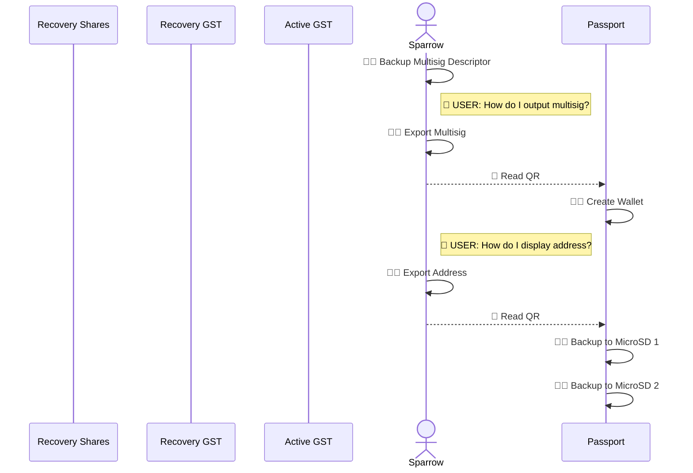
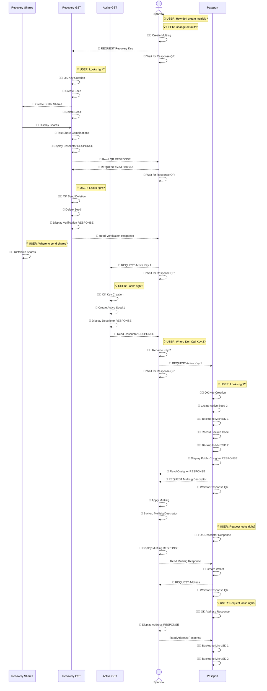

# Improving Multisigs with Request/Response

#### A Use Case for Request/Response

[Multisig Self-Custody Scenario](https://github.com/BlockchainCommons/SmartCustody/blob/master/Docs/Scenario-Multisig.md) describes a methodology for protecting digital assets through the use of multisigs. Through the creation of a multisig using two signing devices and one recovery device, assets are simultaneously protected from both theft and accidental loss.

Unfortunately, the methodology is complex and requires a fair amount of user knowledge of all the devices involved. It's not just that it's inaccessible to a casual user, it's inaccessible to all but the most experienced _and_ dedicated users. We _know_ that [Process Fatigue](https://github.com/BlockchainCommons/SmartCustodyBook/blob/master/manuscript/03-adversaries.md#adversary-process-fatigue) and a desire for [Convenience](https://github.com/BlockchainCommons/SmartCustodyBook/blob/master/manuscript/03-adversaries.md#adversary-convenience) are adversaries that oppose the Smart Custody of digital assets. Thus to truly assist users in securing their digital assets, we need an improved methodology that not only _enables_ the use of multisigs (as a modern, sophisticated transaction coordinator like [Sparrow](https://sparrowwallet.com/) does) but also _simplifies_ and _automates_ the process.

If a user can click "Create Multisig" on their transaction coordinator, and then simply follow instructions and click confirmations then they are _much_ more likely to create a multisig system than if they must connect together all the pieces by hand.

Following is a look at the current system laid out by the Multisig Self-Custody Scenario and a hopeful future system using a Request/Response system. Neither example shows required physical interactions, such as distributing data storage methods to different vaults nor setup steps for any of the software or hardware. The examples may also miss minor actions or decisions, but should both be abstracted to the same level, to provide a clear apples-to-apples comparison. But overall, both of these scenarios are likely even more complex than they seem.

## Classic Scenario

Following is a sequence diagram of the classic design of multisig detailed in [Multisig Self-Custody Scenario](https://github.com/BlockchainCommons/SmartCustody/blob/master/Docs/Scenario-Multisig.md), which makes use of current best-in-class transaction coordinator capabilities found in Sparrow Wallet. 

**Multisig Prep:**

The initial setup is simple enough, and that's about what you want to see with a digital-asset scenario: the user needs to know a little bit, make some decisions, then activate the system.

**Recovery Key (GST) Creation & Input:**

You jump over to the Recovery Key and you see how complex things can get. It's not just that a user has to effectively start over on this new device, but they need to know everything about how it works and initiate numerous actions.

**Active Key #1 (GST) Creation & Input:**

In the Multisig Self-Custody system, Active Key #1 is actually pretty easy to create, but that's solely because it uses the same codebase as the Recovery Key (Gordian Seed Tool). This was a self-imposed limitation of the scenario, which focused on very robust seed storage, but a multisig system ready for deployment should really use three different code bases for its seed storage, which would make this second key's creation as complex as any of the others.

**Active Key #2 (Passport) Creation & Input:**

The third key, on Passport, has different complexities than the first, related to backups and the fact that additional finalization has to be done _after_ the multisig is created. But the notable thing here is that the user has to learn a whole different system.

**Multisig Finalization:**

The multisig finaliation is just as simple as the initial setup.

**Active Key #2 (Passport) Finalization:**

But to finalize the Passport key requires even more work (though it's definitely for a good cause, as it maintains its own copy of the multisig output descriptor, does an extra verification step, and encourages you to update your backups).

Overall, the major abstractions of the current Multisig Self-Custody scenario requires the following steps:

* **5 Decision Points (💡).** _When a user must make a decision._ Obviously, a user will have to make decisions in a process, but these are spread across the whole system and all of the renaming of the keys is unnecessary.
* **11 Research Points (🧠).** _When a user must figure out how to do something._ A user shouldn't have to figure out all of the intricacies of each of his signing devices. They should be cleanly interoperable. This cognitive load is likely the biggest thing holding back usage of a multisig scenario (or many other somewhat complex digital asset tasks). 
* **30 Human Actions (🙎🏽).** _When a user must intiate an action._ Having to actively continue the process 30 times might also be a show stopper, especially when that's on-top of physical activities such as storing things in different places.
* **5 Automated Actions (🤖).** _When the interopable process initiates an action on its own._ In the Scenario, this is all limited to a time when one device has been setup to display a QR and another to read a QR. Only when both of these Human Actions have occurred does an Automated Action (briefly) continue.

The imbalance of Research Points (🧠) and Human Actions (🙎🏽) to Automated Actions (🤖) is clearly the heart of the problem with the currently possible Multisig Self-Custody Scenario. But there are at least two other issues:

* **No Linear Progression.** There isn't a clear progress for the process, other than following along in the detailed [Multisig Self-Custody Scenario](https://github.com/BlockchainCommons/SmartCustody/blob/master/Docs/Scenario-Multisig.md). And that requires jumping all around. You setup things on the transaction coordinator, and then you have to know to jump to another device before finally reading back into the transaction coordinator. Without the written scenario (and based on our tests, even with it), a user is lost.
* **No Metadata.** A lack of metadata means that no device ever knows what it's communicating with unless a user tells them. As a result, the user constantly needs to tell the transaction coordinator exactly what device it's going to read from and even afterward he has to make changes like renaming keys.

## Request/Response Scenario

Two 

