# Improving Multisigs with Request/Response

#### A Use Case for Request/Response

The [Multisig Self-Custody Scenario](https://github.com/BlockchainCommons/SmartCustody/blob/master/Docs/Scenario-Multisig.md) describes a methodology for protecting digital assets via the use of multisigs. Through the creation of a multisig built with two signing devices and one recovery device, assets are simultaneously protected from theft and accidental loss.

Unfortunately, the methodology is complex and requires a fair amount of user knowledge of all the devices involved. It's not just that it's inaccessible to a casual user: it's inaccessible to all but the most experienced _and_ dedicated users. We _know_ that [Process Fatigue](https://github.com/BlockchainCommons/SmartCustodyBook/blob/master/manuscript/03-adversaries.md#adversary-process-fatigue) and a desire for [Convenience](https://github.com/BlockchainCommons/SmartCustodyBook/blob/master/manuscript/03-adversaries.md#adversary-convenience) are adversaries that oppose the Smart Custody of digital assets. Thus to truly assist users in securing their digital assets, we need an improved methodology that not only _enables_ the use of multisigs (as a modern, sophisticated transaction coordinator like [Sparrow](https://sparrowwallet.com/) does) but also _simplifies_ and _automates_ the process.

If a user can click "Create Multisig" on their transaction coordinator and then simply follow instructions and click confirmations then they are _much_ more likely to adopt a multisig asset-protection methodology than if they must connect together all the pieces by hand.

Following is a look at the current schema laid out by the [Multisig Self-Custody Scenario](https://github.com/BlockchainCommons/SmartCustody/blob/master/Docs/Scenario-Multisig.md) and a hopeful future system using a request/response system such as [Envelope Request/Response](https://developer.blockchaincommons.com/envelope/request/). Neither example shows required physical interactions, such as distributing data storage methods to different vaults, nor setup steps for any of the software or hardware. These examples may also miss minor actions or decisions, but should both be abstracted to the same level, to provide a clear apples-to-apples comparison. (But overall, both of these scenarios are likely even more complex than they seem.)

## Classic Scenario

Following is a sequence diagram of the classic design of multisig detailed in [Multisig Self-Custody Scenario](https://github.com/BlockchainCommons/SmartCustody/blob/master/Docs/Scenario-Multisig.md), which makes use of current best-in-class transaction coordinator capabilities found in Sparrow Wallet. 

**Multisig Prep:**

The initial setup is simple enough, and that's the way it should work for a digital-asset scenario: the user should know a little bit, make a few decisions, then activate the system.

```mermaid
sequenceDiagram
participant Rs as Recovery Shares
participant R as Recovery GST
participant S1 as Active GST
actor TC as Sparrow
participant S2 as Passport

note right of TC: 🧠 USER: How do I create multisig?
note right of TC: 💡 USER: What multisig?
TC->>TC: 🙎🏽 Create Multisig
```

**Recovery Key (GST) Creation & Input:**

But in the current scenario, when you jump over to the Recovery Key, you can see how complex things can get. It's not just that a user has to effectively start over on this new device, but they need to know everything about how it works and to initiate numerous actions.

```mermaid
sequenceDiagram
participant Rs as Recovery Shares
participant R as Recovery GST
participant S1 as Active GST
actor TC as Sparrow
participant S2 as Passport

note right of R: 🧠 USER: How do I create seed?
R->>R: 🙎🏽 Create Recovery Seed
note right of R: 🧠 USER: How do I shard seed?
R->>Rs: 🙎🏽 Create SSKR Shares
R->>R: 🙎🏽 Delete Seed
Rs->>R: 🙎🏽 Test SSKR Shares A+B
R->>R: 🙎🏽 Delete Seed
Rs->>R: 🙎🏽 Test SSKR Shares B+C
R->>R: 🙎🏽 Delete Seed
Rs->>R: 🙎🏽 Test SSKR Shares A+C

note right of R: 🧠 USER: How do I find descriptor?
R->>R: 🙎🏽 Display Descriptor
note right of TC: 🧠 USER: How do I scan from GST?
TC->>TC: 🙎🏽 Initiate Scanning
R-->>TC: 🤖 Read Descriptor
note right of TC: 💡 USER: Where Do I Call Key 1?
TC->>TC: 🙎🏽 Rename Key 1
R->>R: 🙎🏽 Delete Seed
note right of Rs: 💡 USER: Where to send shares?
Rs->>Rs: 🙎🏽 Distribute Shares
```

**Active Key #1 (GST) Creation & Input:**

In the Multisig Self-Custody system, Active Key #1 is then pretty easy to create, but that's solely because it uses the same codebase as the Recovery Key (Gordian Seed Tool). This was a self-imposed limitation of the scenario, which focused on very robust seed storage, but a multisig system ready for deployment should really use three different codebases for its seed storage, which would make this second key's creation as complex as any of the others.

```mermaid
sequenceDiagram
participant Rs as Recovery Shares
participant R as Recovery GST
participant S1 as Active GST
actor TC as Sparrow
participant S2 as Passport

S1->>S1: 🙎🏽 Create Active Seed 1
S1->>S1: 🙎🏽 Display Descriptor
TC->>TC: 🙎🏽 Initiate Scanning
S1-->>TC: 🤖 Read Descriptor
note right of TC: 💡 USER: Where Do I Call Key 2?
TC->>TC: 🙎🏽 Rename Key 2
```

**Active Key #2 (Passport) Creation & Input:**

In the Multisig Self-Custody system, Active Key #2, whihch is generated on a Passport, has different complexities than the first, related to backups and the fact that additional finalization has to be done _after_ the multisig is created. But the notable thing here is that the user has to learn a whole different system.

```mermaid
sequenceDiagram
participant Rs as Recovery Shares
participant R as Recovery GST
participant S1 as Active GST
actor TC as Sparrow
participant S2 as Passport

note right of S2: 🧠 USER: How do create seed?
S2->>S2: 🙎🏽 Create Active Seed 2
S2->>S2: 🙎🏽 Backup to MicroSD 1
S2->>S2: 🙎🏽 Record Backup Code
S2->>S2: 🙎🏽 Backup to MicroSD 2
note right of S2: 🧠 USER: How do I display correct QR?
S2->>S2: 🙎🏽 Display Public Cosigner QR
note right of TC: 🧠 USER: How do I scan from PP?
S2-->>TC: 🤖 Read QR
note right of TC: 💡 USER: Where Do I Call Key 3?
```

**Multisig Finalization:**

The multisig finalization is just as simple as the initial setup.

```mermaid
sequenceDiagram
participant Rs as Recovery Shares
participant R as Recovery GST
participant S1 as Active GST
actor TC as Sparrow
participant S2 as Passport

TC->>TC: 🙎🏽 Apply Multisig
note right of TC: 🧠 USER: How do I backup multisig?
```

**Active Key #2 (Passport) Finalization:**

But to finalize the Passport key requires even more work (though it's definitely for a good cause, as it maintains the Passport own copy of the multisig output descriptor, does an extra verification step, and encourages the user to update their backups).

```mermaid
sequenceDiagram
participant Rs as Recovery Shares
participant R as Recovery GST
participant S1 as Active GST
actor TC as Sparrow
participant S2 as Passport

TC->>TC: 🙎🏽 Backup Multisig Descriptor
note right of TC: 🧠 USER: How do I output multisig?
TC->>TC: 🙎🏽 Export Multisig
TC-->>S2: 🤖 Read QR
S2->>S2: 🙎🏽 Create Wallet
note right of TC: 🧠 USER: How do I display address?
TC->>TC: 🙎🏽 Export Address
TC-->>S2: 🤖 Read QR
S2->>S2: 🙎🏽 Backup to MicroSD 1
S2->>S2: 🙎🏽 Backup to MicroSD 2
```

Overall, this abstraction of the current Multisig Self-Custody scenario demonstrates the following steps:

* **5 Decision Points (💡).** _When a user must make a decision._ Obviously, a user will have to make decisions in a process, but thoughtful decisions are spread across the whole system and all of the renaming of the keys is unnecessary.
* **11 Research Points (🧠).** _When a user must figure out how to do something._ A user shouldn't have to figure out all of the intricacies of each of his signing devices. Instead, they should be cleanly interoperable: when a user figures out how to start a process, it should continue straight through without more learning required. This cognitive load is likely the biggest thing holding back usage of a multisig scenario (or many other somewhat complex digital-asset tasks). 
* **30 Human Actions (🙎🏽).** _When a user must intiate an action._ Having to actively continue the process 30 times, in a wide variety of ways (requiring constant reference to the Scenario checklist) might also be a show stopper, especially when that's on-top of physical activities such as storing things in different places.
* **5 Automated Actions (🤖).** _When the interopable process initiates an action on its own._ In the Scenario, Automated Actions are limited to those times when one device has been setup to display a QR and another to read a QR. Only when both of these Human Actions have occurred does an Automated Action (briefly) continue.

The imbalance of Research Points (11 🧠) and Human Actions (30 🙎🏽) to Automated Actions (5 🤖) is clearly the heart of the problem with the currently possible Multisig Self-Custody Scenario. But there are at least two other issues:

* **No Linear Progression.** There isn't a clear progress for the process, other than following the checklists in the detailed [Multisig Self-Custody Scenario](https://github.com/BlockchainCommons/SmartCustody/blob/master/Docs/Scenario-Multisig.md). And that requires jumping all around in the physical world. You setup things on the transaction coordinator, and then you have to know to jump to another device before finally reading back into the transaction coordinator. Without the written scenario (and based on our tests, even with it), a user is lost.
* **No Metadata.** A lack of metadata means that no device ever knows what other device it's communicating with. As a result, the user constantly needs to tell the transaction coordinator exactly what device it's going to read from and even afterward he has to make changes like renaming keys.

[See a diagram of the whole "Classic Scenario" process.](Scenario-Multisig-RR-Classic.md)

## Request/Response Scenario

Blockchain Commons' forwarding-look Request-Response Scenario is meant to solve these problems primarily through the application of [Gordian Envelopes](https://developer.blockchaincommons.com/envelope/). Obviously individual seed vaults and transaction coordinators would need to build Envelopes into their standard processing methodology to make full use of the capabilities, and that's what's described here.

Envelopes solve the problems of the Classic scenario via two main means:

* **Request/Response.** Gordian Envelopes have a [Request/response system](https://developer.blockchaincommons.com/envelope/request/) that allow machines to send each other function calls remotedly. Currently, request/response supports calls to send seeds, send keys, send output descriptors, and sign PSBTs. This scenario imagines new request/response calls to create recovery seeds, create active seeds, delete seeds, send remote addresses, and send remote multisig descriptors that would be trivial to add. Through the use of request/response, this scenario creates a linear progression that at _every_ step across multiple devices prompts a user with what to do next, greatly simplifying the multisig setup (and removing the need for a written scenario).
* **Metadata.** Envelopes can carry arbitrary metadata alongside their payload. This resolves the other major problem with the classic scenario, where even when QR codes transmit data from one device to another, there was still no ability for the transaction coordinator to view the larger scenario (for example, what device it was working with, and what notes or other data the device might have about the seed being used to generate a key).

Though many of the specific Requests in this scenario are out-of-bounds for the current Request/Response specification, they are well-within the capability of Envelope and could be quickly added when working with hardware-wallet designers to create such a scenario.

**Multisig Prep:**

The prep is very similar to the prep in the Classic Scenario, except here a user will preload all their major choices for the entire scenario by choosing how to create their multisig and with what devices. From there, the transaction coordinator will be able to use Requests and Responses to walk through the entire process.

```mermaid
sequenceDiagram
participant Rs as Recovery Shares
participant R as Recovery GST
participant S1 as Active GST
actor TC as Sparrow
participant S2 as Passport

note right of TC: 🧠 USER: How do I create multisig?
note right of TC: 💡 USER: Change defaults?
TC->>TC: 🙎🏽 Create Multisig
```

**Recovery Key (GST) Creation & Input:**

The standard procedure for a Request/Response interaction between the transaction coordinator and a seed-vault device is as follows:

1. The transaction coordinator makes a Request
2. The transaction coordinator begins waiting for a Response
3. The user reads the Request with the remote device
4. The user OKs the Request on the remote device
5. The remote device does its stuff
6. The remote device displays a Response
7. The user reads the Response with the transaction coordinator

Obviously, there's the opportunity for more human interaction at each step, depending on the exact needs on the device. In this case, after the Seed Vault outputs the SSKR shares, the user will have to read them back into the device, and down the road they'll have to figure out how to distribute them. But, those human interactions are minimized to to the [best practice](https://developer.blockchaincommons.com/envelope/request/#best-practices-for-request--response) of responding to Requests and to the activities requiring _physical_ intervention of some sort.

```mermaid
sequenceDiagram
participant Rs as Recovery Shares
participant R as Recovery GST
participant S1 as Active GST
actor TC as Sparrow
participant S2 as Passport

TC-->>R: 🤖 REQUEST Recovery Key
TC-->>TC: 🤖 Wait for Response QR

note right of R: 💡 USER: Looks right?
R->>R: 🙎🏽 OK Key Creation
R-->>R: 🤖 Create Seed
R-->>Rs: 🤖 Output SSKR Shares
R-->>R: 🤖 Delete Seed
Rs->>R: 🙎🏽 Display Output Shares
R-->>R: 🤖 Test Share Combinations
R-->>R: 🤖 Display Descriptor RESPONSE
R-->>TC: 🤖 Read Descriptor RESPONSE

TC-->>R: 🤖 REQUEST Seed Deletion
TC-->>TC: 🤖 Wait for Response QR
note right of R: 💡 USER: Looks right?
R->>R: 🙎🏽 OK Seed Deletion
R-->>R: 🤖 Delete Seed
R-->>R: 🤖 Display Verification RESPONSE
R-->>TC: 🤖 Read Verification Response
note right of Rs: 💡 USER: Where to send shares?
Rs->>Rs: 🙎🏽 Distribute Shares
```

**Active Key #1 (GST) Creation & Input:**

In the simplest situation, all a user has to do is OK the remote activity on the seed vault. The devices and the Request/Response system take care of the rest.

```mermaid
sequenceDiagram
participant Rs as Recovery Shares
participant R as Recovery GST
participant S1 as Active GST
actor TC as Sparrow
participant S2 as Passport

TC-->>S1: 🤖 REQUEST Active Key 1
TC-->>TC: 🤖 Wait for Response QR
note right of S1: 💡 USER: Looks right?
S1->>S1: 🙎🏽 OK Key Creation
S1-->>S1: 🤖 Create Active Seed 1
S1-->>S1: 🤖 Display Descriptor RESPONSE
S1-->>TC: 🤖 Read Descriptor RESPONSE
```

**Active Key #2 (Passport) Creation & Input:**

The Passport offers another example where a bit of physical interaction is still requiring, here to insert the two MicroSDs into the Passport for backup and to physically record a backup code. 

(Could the backup code be recorded by the transaction coordinator using metadata? Definitely! Should it? That's a more difficult question, but it could be stored safely and securely by putting it in an Envelope, sharding it, and storing those shares on the transaction coordinator and the other devices, but that's a more complex scenario than what's laid out here. Instead, this scenario keeps itself to an example automation of the Classic Scenario.)

```mermaid
sequenceDiagram
participant Rs as Recovery Shares
participant R as Recovery GST
participant S1 as Active GST
actor TC as Sparrow
participant S2 as Passport

TC-->>S2: 🤖 REQUEST Active Key 2
TC-->>TC: 🤖 Wait for Response QR
note right of S2: 💡 USER: Looks right?
S2->>S2: 🙎🏽 OK Key Creation
S2-->>S2: 🤖 Create Active Seed 2
S2->>S2: 🙎🏽 Backup to MicroSD 1
S2->>S2: 🙎🏽 Record Backup Code
S2->>S2: 🙎🏽 Backup to MicroSD 2
S2-->>S2: 🤖 Display Public Cosigner RESPONSE
S2-->>TC: 🤖 Read Cosigner RESPONSE
S2-->>TC: 🤖 REQUEST Multisig Descriptor
S2-->>S2: 🤖 Wait for Response QR
```

**Multisig Finalization:**

As usual the finalization of the multisig on the transaction coordinator is simple.

```mermaid
sequenceDiagram
participant Rs as Recovery Shares
participant R as Recovery GST
participant S1 as Active GST
actor TC as Sparrow
participant S2 as Passport

TC-->>TC: 🤖 Apply Multisig
TC-->>TC: 🤖 Backup Multisig Descriptor
```

**Active Key #2 (Passport) Finalization:**

However, there was a bit of a twist at the end of the Passport Active Key creation. After sending the Response to the transaction coordinator, the Passport then created a new Request: "🤖 REQUEST Multisig Descriptor". This previously required more human intervention for the user to find the data that the Passport wants. Now, after the multisig is created, the user just shows the transaction coordinator the new Request from the Passport, and afterward the two devices can 
iteration through the Passport's final data acquisition.

```mermaid
sequenceDiagram
participant Rs as Recovery Shares
participant R as Recovery GST
participant S1 as Active GST
actor TC as Sparrow
participant S2 as Passport

note right of S2: 💡 USER: Request looks right?
S2->>S2: 🙎🏽 OK Multisig Response
TC-->>TC: 🤖 Display Multisig RESPONSE
TC-->>S2: Read Multisig Response
S2->>S2:- 🤖 Create Wallet
S2-->>TC: 🤖 REQUEST Address
S2-->>S2: 🤖 Wait for Response QR

note right of S2: 💡 USER: Request looks right?
S2->>S2: 🙎🏽 OK Address Response
TC-->>TC: 🤖 Display Address RESPONSE
TC-->>S2: Read Address Response
S2->>S2: 🙎🏽 Backup to MicroSD 1
S2->>S2: 🙎🏽 Backup to MicroSD 2
```
