# Improving Multisigs with Request/Response

#### A Use Case for Request/Response

[Multisig Self-Custody Scenario](https://github.com/BlockchainCommons/SmartCustody/blob/master/Docs/Scenario-Multisig.md) describes a methodology for protecting digital assets through the use of multisigs. Through the creation of a multisig using two signing devices and one recovery device, assets are simultaneously protected from both theft and accidental loss.

Unfortunately, the methodology is complex and requires a fair amount of user knowledge of all the devices involved. It's not just that it's inaccessible to a casual user, it's inaccessible to all but the most experienced _and_ dedicated users. We _know_ that [Process Fatigue](https://github.com/BlockchainCommons/SmartCustodyBook/blob/master/manuscript/03-adversaries.md#adversary-process-fatigue) and a desire for [Convenience](https://github.com/BlockchainCommons/SmartCustodyBook/blob/master/manuscript/03-adversaries.md#adversary-convenience) are adversaries that oppose the Smart Custody of digital assets. Thus to truly assist users in securing their digital assets, we need an improved methodology that not only _enables_ the use of multisigs (as a modern, sophisticated transaction coordinator like [Sparrow](https://sparrowwallet.com/) does) but also _simplifies_ and _automates_ the process.

If a user can click "Create Multisig" on their transaction coordinator, and then simply follow instructions and click confirmations then they are _much_ more likely to create a multisig system than if they must connect together all the pieces by hand.

Following is a look at the current system laid out by the Multisig Self-Custody Scenario and a hopeful future system using a Request/Response system. Neither example shows required physical interactions, such as distributing data storage methods to different vaults nor setup steps for any of the software or hardware. The examples may also miss minor actions or decisions, but should both be abstracted to the same level, to provide a clear apples-to-apples comparison. But overall, both of these scenarios are likely even more complex than they seem.

## Classic Scenario

Following is a sequence diagram of the classic design of multisig detailed in [Multisig Self-Custody Scenario](https://github.com/BlockchainCommons/SmartCustody/blob/master/Docs/Scenario-Multisig.md), which makes use of current best-in-class transaction coordinator capabilities found in Sparrow Wallet. 

**Multisig Prep:**

```mermaid
sequenceDiagram
participant Rs as Recovery Shares
participant R as Recovery GST
participant S1 as Active GST
actor TC as Sparrow
participant S2 as Passport

note right of TC: 🧠 USER: How do I create multisig?
note right of TC: 💡 USER: What multisig?
TC->>TC: 🙎🏽 Create Multisig
```

**Recovery Key (GST) Creation & Input:**

```mermaid
sequenceDiagram
participant Rs as Recovery Shares
participant R as Recovery GST
participant S1 as Active GST
actor TC as Sparrow
participant S2 as Passport

note right of R: 🧠 USER: How do I create seed?
R->>R: 🙎🏽 Create Recovery Seed
note right of R: 🧠 USER: How do I shard seed?
R->>Rs: 🙎🏽 Create SSKR Shares
R->>R: 🙎🏽 Delete Seed
Rs->>R: 🙎🏽 Test SSKR Shares A+B
R->>R: 🙎🏽 Delete Seed
Rs->>R: 🙎🏽 Test SSKR Shares B+C
R->>R: 🙎🏽 Delete Seed
Rs->>R: 🙎🏽 Test SSKR Shares A+C

note right of R: 🧠 USER: How do I find descriptor?
R->>R: 🙎🏽 Display Descriptor
note right of TC: 🧠 USER: How do I scan from GST?
TC->>TC: 🙎🏽 Initiate Scanning
R-->>TC: 🤖 Read Descriptor
note right of TC: 💡 USER: Where Do I Call Key 1?
TC->>TC: 🙎🏽 Rename Key 1
R->>R: 🙎🏽 Delete Seed
note right of Rs: 💡 USER: Where to send shares?
Rs->>Rs: 🙎🏽 Distribute Shares
```

**Active Key #1 (GST) Creation & Input:**

```mermaid
sequenceDiagram
participant Rs as Recovery Shares
participant R as Recovery GST
participant S1 as Active GST
actor TC as Sparrow
participant S2 as Passport

S1->>S1: 🙎🏽 Create Active Seed 1
S1->>S1: 🙎🏽 Display Descriptor
TC->>TC: 🙎🏽 Initiate Scanning
S1-->>TC: 🤖 Read Descriptor
note right of TC: 💡 USER: Where Do I Call Key 2?
TC->>TC: 🙎🏽 Rename Key 2
```

**Active Key #2 (Passport) Creation & Input:**

```mermaid
sequenceDiagram
participant Rs as Recovery Shares
participant R as Recovery GST
participant S1 as Active GST
actor TC as Sparrow
participant S2 as Passport

note right of S2: 🧠 USER: How do create seed?
S2->>S2: 🙎🏽 Create Active Seed 2
S2->>S2: 🙎🏽 Backup to MicroSD 1
S2->>S2: 🙎🏽 Record Backup Code
S2->>S2: 🙎🏽 Backup to MicroSD 2
note right of S2: 🧠 USER: How do I display correct QR?
S2->>S2: 🙎🏽 Display Public Cosigner QR
note right of TC: 🧠 USER: How do I scan from PP?
S2-->>TC: 🤖 Read QR
note right of TC: 💡 USER: Where Do I Call Key 3?
```

**Multisig Finalization:**

```mermaid
sequenceDiagram
participant Rs as Recovery Shares
participant R as Recovery GST
participant S1 as Active GST
actor TC as Sparrow
participant S2 as Passport

TC->>TC: 🙎🏽 Apply Multisig
note right of TC: 🧠 USER: How do I backup multisig?
```

**Active Key #2 (Passport) Finalization:**

```mermaid
sequenceDiagram
participant Rs as Recovery Shares
participant R as Recovery GST
participant S1 as Active GST
actor TC as Sparrow
participant S2 as Passport

TC->>TC: 🙎🏽 Backup Multisig Descriptor
note right of TC: 🧠 USER: How do I output multisig?
TC->>TC: 🙎🏽 Export Multisig
TC-->>S2: 🤖 Read QR
S2->>S2: 🙎🏽 Create Wallet
note right of TC: 🧠 USER: How do I display address?
TC->>TC: 🙎🏽 Export Address
TC-->>S2: 🤖 Read QR
S2->>S2: 🙎🏽 Backup to MicroSD 1
S2->>S2: 🙎🏽 Backup to MicroSD 2
```

[problems]
[X research points] 🧠
[Y decision points] 💡
[Y actions] ❗
[no linear progression]
[no metadata, so no extra info transmitted]

