# Multisig Self-Custody Scenario

#### _Best practices for protecting Your personal digital assets using a multi-sig_

**THIS IS FULLY DRAFTED, BUT NOT FULLY REVIEWED; IT SHOULD NOT BE CONSIDERED READY FOR USAGE.**

## Introduction to the Multisig Scenario

Digital assets held personally ("self-custody") face two major dangers: single point of failure (SPOF) and single point of compromise (SPOC), which is to say losing those assets either those loss or theft. Traditional self-custody solutions focus on decreasing SPOF with methodologies like seed backup, but in doing so tend to increase the possibility of SPOC. This is generally in tune with the adversaries that the average self-custodian would be facing. However, now that multisig is sufficiently deployed to allow ease-of-use, it can simultaneously decrease both SPOF and SPOC at a relatively small cost to convenience and complexity. 

This scenario explains how to do so. It does so by using a transaction coordinator on a computer, to manage the receipt and spending of funds while holding no keys, alongside two second-generation signing devices[^1] that hold those keys. SSKR shares are then used to divide up a third, recoveyr, key.

**WARNING:** It is important that you initiate this scenario when you have a large block of time: usually at least two hours when you will not be interrupted and when you will not be distracted. You don't want to make mistakes, and to avoid that it's best to do everything in one go.

### About The Base Scenario

The base scenario presumes an audience with all of the following characteristics:

* A holder with a significant amount of digital assets (>10% of net worth);
    - with full and legal custody of the assets and no fiduciary responsibility to others;
    - and 100% of those assets shared with a spouse, if present, in estate planning.
* A holder who might be trading those assets actively or might be holding them long temr.
* A holder who lives in the first world, and thus is less concerned about issues like government attack, kidnapping, or privacy violations.
* A holder who has sufficient computer skills to comfortably install and run apps.

This scenario advocates the basic procedure to address XXX major types of adversaries, while the optional procedures can help protect against XXX further adversaries. Additional categories of "Non-Theft Crimes", "Loss by Government" and "Privacy-Related" adversaries are not strongly considered in this scenario. See **Adversaries**.

For simplicity, this document focuses on Bitcoin; adapting it to other cryptocurrencies may require choosing different signing devices.

{pagebreak}

## Procedure Overview

This procedure incorporates the following steps:

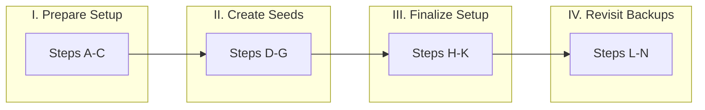

**PART ONE: PREPARE SETUP**

* **[Step A: Setup Storage Locales](https://github.com/BlockchainCommons/SmartCustody/blob/master/Docs/Scenario-Multisig.md#step-a-setup-storage-locales).** Prepare three locales for storing key material.
* **[Step B: Prepare Computer](https://github.com/BlockchainCommons/SmartCustody/blob/master/Docs/Scenario-Multisig.md#step-b-prepare-computer).** Load transaction coordinator.
* **[Step C: Create Multisig](https://github.com/BlockchainCommons/SmartCustody/blob/master/Docs/Scenario-Multisig.md#step-c-create-multisig).** Create multisig in transaction coordinator.

**PART TWO: CREATE SEEDS**

* **[Step D: Create Recovery Seed](https://github.com/BlockchainCommons/SmartCustody/blob/master/Docs/Scenario-Multisig.md#step-d-create-recovery-seed).** Create a seed and shard it.
* **[Step E: Test & Input Recovery Seed](https://github.com/BlockchainCommons/SmartCustody/blob/master/Docs/Scenario-Multisig.md#step-e-test--input-recovery-seed).** Test the seed shards.
* **[Step F: Create & Input Active Seed #1](https://github.com/BlockchainCommons/SmartCustody/blob/master/Docs/Scenario-Multisig.md#step-f-create--test-active-seed-1).** Create a second seed.
* **[Step G: Create & Input Active Seed #2](https://github.com/BlockchainCommons/SmartCustody/blob/master/Docs/Scenario-Multisig.md#step-g-create--test-active-seed-2).** Create a third seed.

**PART THREE: FINALIZE SETUP**

* **[Step H: Finalize Multisig](https://github.com/BlockchainCommons/SmartCustody/blob/master/Docs/Scenario-Multisig.md#step-h-finalize-multisig).** Complete multisig in transaction coordinator.
* **[Step I: Test Transaction](https://github.com/BlockchainCommons/SmartCustody/blob/master/Docs/Scenario-Multisig.md#step-i-test-transaction).** Test out receipt and sending of funds.
* **[Step J: Transfer Funds](https://github.com/BlockchainCommons/SmartCustody/blob/master/Docs/Scenario-Multisig.md#step-j-transfer-funds).** Iteratively transfer funds.
* **[Step K: Ensure Inheritance](https://github.com/BlockchainCommons/SmartCustody/blob/master/Docs/Scenario-Multisig.md#step-k-ensure-inheritance).** Prepare for the future.

**PART FOUR: REVISIT BACKUPS**

* **[Step L: Check Primary Storage (Spring)](https://github.com/BlockchainCommons/SmartCustody/blob/master/Docs/Scenario-Multisig.md#step-l-check-primary-storage-spring).** Each spring, test main backups.
* **[Step M: Check Secondary Storage (Fall)](https://github.com/BlockchainCommons/SmartCustody/blob/master/Docs/Scenario-Multisig.md#step-m-check-secondary-storage-fall).** Each fall, test other backups.
* **[Step N: Update MicroSDs](https://github.com/BlockchainCommons/SmartCustody/blob/master/Docs/Scenario-Multisig.md#step-n-update-microsds).** Every three years, replace MicroSDs.

**OPTIONS: ALTERNATIVE SETUPS**

* **[Option I: Additional Steps](https://github.com/BlockchainCommons/SmartCustody/blob/master/Docs/Scenario-Multisig.md#options-i-additional-steps)** — TBA, additional techniques to conquer adversaries.
* **[Option II: Alternative Signing Devices](https://github.com/BlockchainCommons/SmartCustody/blob/master/Docs/Scenario-Multisig.md#options-ii-alternative-signing-devices)** — TBA, choosing signing devices for alternative scenarios.

**APPENDICES: FURTHER INFORMATION**

* **[Appendix I: SPOCs & SPOFs in This Scenario](https://github.com/BlockchainCommons/SmartCustody/blob/master/Docs/Scenario-Multisig.md#appendix-i-spofs--spocs-in-this-scenario) — Compromise & Failure.
* 
### Requirements

The following items are necessary for this procedure, and should be purchased[^sca] in advance of your setting up this scenario.

* [  ] Existing Laptop or Desktop Computer capable of running [Sparrow Wallet(https://sparrowwallet.com/).
* [  ] 1 Package Waterproof Laser Paper (TerraSlate, made of 1-PET [https://www.amazon.com/TerraSlate-Paper-Waterproof-Printer-Sheets/dp/B00NWVGOF4](https://www.amazon.com/TerraSlate-Paper-Waterproof-Printer-Sheets/dp/B00NWVGOF4) or Rite in the Rain All-Weather Copier Paper, made of coated recyclable wood [https://www.amazon.com/Rite-Rain-All-Weather-Copier-8511/dp/B0016H1RYE/](https://www.amazon.com/Rite-Rain-All-Weather-Copier-8511/dp/B0016H1RYE/) or equivalent)

Three devices are required to hold seeds: two active devices and one recovery device. We suggest the following:

* [  ] [Foundation Devices Passport](https://foundationdevices.com/passport/details/) for active ssed.
* [  ] iPhone or iPod to run [Gordian Seed Tool](https://apps.apple.com/us/app/gordian-seed-tool/id1545088229) for active seed.
* [  ] Separate[^2] iPhone or iPod to temporarily create and shard recovery seed using [Gordian Seed Tool](https://apps.apple.com/us/app/gordian-seed-tool/id1545088229).

The three devices selected are all second-generation signing device technology[^3][^4]. See the footnotes for discussions of why we choose these specifically[^5].  See Step C for making different choices.

The following items are recommended, but don't let their absence stop you from securing your digital assets:

* [  ] Small Home Safe (For example: [https://www.amazon.com/AmazonBasics-Security-Safe-0-5-Cubic-Feet/dp/B00UG9HB1Q/](https://www.amazon.com/AmazonBasics-Security-Safe-0-5-Cubic-Feet/dp/B00UG9HB1Q/) )
* [  ] Safety Deposit Box at Bank or other institution

The following items are even more optional, but will increase the resilience of your scenario:

* [  ] SD Card Reader for iPhone (For example [https://www.amazon.com/gp/product/B09CKZ41XP/ref=ppx_yo_dt_b_asin_title_o00_s00?ie=UTF8&psc=1](https://www.amazon.com/gp/product/B09CKZ41XP/ref=ppx_yo_dt_b_asin_title_o00_s00?ie=UTF8&psc=1) )
* [  ] MicroSD Adapter with an extra MicroSD card (For example [https://www.amazon.com/gp/product/B08K8H6Q6T/ref=ppx_yo_dt_b_search_asin_title?ie=UTF8&psc=1](https://www.amazon.com/gp/product/B08K8H6Q6T/ref=ppx_yo_dt_b_search_asin_title?ie=UTF8&psc=1) ): though not required for the procedure, this will allow you to read MicroSD cards, such as those used by the Passport, on other devices. Overally, you will want to have 3 MicroSD cards. If you use the default procedure, you will purchase one with this Adapter and have two others from your Passport.
* [  ] Encrypted Cloud-based note storage, such as [LastPass](https://www.lastpass.com/)
* 
### Final State

Your material should be divided among four places: your home; secure storage in your home; offsite primary storage; and offsite secondary storage. The following shows the layout of materials that you'll keep in each if you use the default scenario with Sparrow as transaction coordinator and a Foundation Devices Passport and Gordon Seed Tool (GST) as signing devices, with a third, recovery key sharded.

| Home | Home Storage | Primary Storage | Secondary Storage | Cloud |
| :--- | :--- | :--- | :--- | :--- | 
|  | Recovery SSKR Overview<br>Recovery SSKR Share #1 | Recovery SSKR Share #2 | Recovery SSKR Share #3 |
| Sparrow Computer |
| GST iPhone | GST SSKR Share #1 (opt.) | iPhone PIN<br>Apple Account & Password<br>Apple Recovery Code | | GST Backup |
|  | Passport | Passport MicroSD #1<br>w/GST SSKR Share #2 (opt.) | Passport MicroSD #2<br>w/GST SSKR Share #3 (opt.) |
| | Passport Backup Words |  Passport PIN |  | Passport PIN<br>Passport Backup Words (opt.) |
| | Account Descriptor | Account Descriptor | Account Descriptor | Account Descriptor (opt.) |
| | Instructions for heirs | Instructions for heirs | Instructions for heirs |

Obviously this state will vary if alternative signing devices are chosen.

{pagebreak}

## The Basic Procedure

### PART ONE: PREPARE SETUP

#### **Step A: Setup Storage Locales**

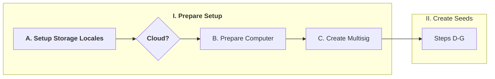

You will require two to three storage locales: Home Storage Locale, Primary Storage Locale, and Secondary Storage Locale[^6]. They will be used to store seeds and devices[^7]. 

1. [  ] Install Home Safe[^8][^9]
   1. Ideally, it should be physically secured by mounting it to floor or wall joists, or even more securely, directly to a foundation
   1. You will store an SSKR share in your Home Storage Locale, usually along with your Secondary Signing Device (by default: a Passport), if it's in regular usage.
2. [  ] Choose Primary Storage Locale
   1. Ideally, this should be a bank safety deposit box. But, if you don't have one, choose the most secure location you can think of outside of your house.
   1. You will store an SSKR share in your Primary Store Locale, might store your Secondary Signing Device (by default: a Passport) if it's not in regular usage, and possibly other backup material
3. [  ] Choose Secondary Storage Locale
   1. This may be a somewhat less secure locale that your Home Storage Locale and your Primary Storage Locale.
   1. Options include your work, your parent's house, a trusted friend's house.
   1. You will only store backups at your Secondary Storage Locale: an SSKR share and possibly other backup material

**Optional Resilience Improvement: Prepare Cloud Backup.** Optionally, prepare encrypted cloud storage that will allow you to back up some minimal textual data in case of a physical disaster. LastPass's "Notes" feature is one methodology.

#### **Step B: Prepare Computer**

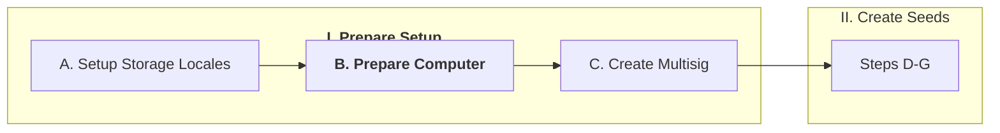

Because your computer never holds seeds, you don't need to do the same extensive work securing it as you might have with previous generations of signing devices. However, it's best to use a computer that you're careful with. If you have a computer that's not used much, and especially one that's not used for web browsing, that's a good choice[^10].

**Sparrow Requirements:** Windows 7+; OSX 10.13+; or Linux (especially Ubuntu, Debian, Redhat, or Cenix).

1. [  ] Download [Sparrow Wallet](https://sparrowwallet.com/download/).
1. [  ] Also download the manifest and the manifest signature from the same page.
1. [  ] Verify the signature[^11].
   1. `curl https://keybase.io/craigraw/pgp_keys.asc | gpg --import`
   1. `gpg --verify sparrow-X.X.X-manifest.txt.asc`where X.X.X is the version number
   1. You should be looking for a "Good Signature", probably from Craig Raw
1. [  ] Verify the checksum[^11].
   1. **Windows:** `CertUtil -hashfile Sparrow-X.X.X.exe SHA256 | findstr /v "hash"` and compare to the checksum in the `manifest.txt` file.
   1. **MacOS:** `sha256sum --check sparrow-X.X.X-manifest.txt --ignore-missing` and look for OK.
   1. **Linux:** `sha256sum --check sparrow-X.X.X-manifest.txt --ignore-missing` and look for OK.
1. [  ] If the program verified, install as appropraite for your OS.

#### **Step C: Create Multisig**

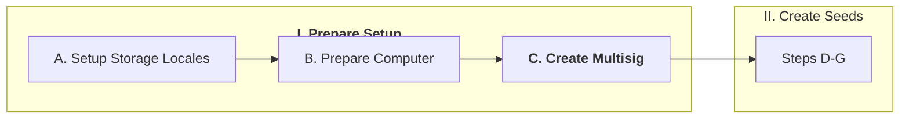

The creation of a multisig is initiated on your transaction coordinator. This scenario suggests a 2-of-3 multisig.

1. [  ] Create a new multisig in Sparrow.
   1. "File -> New Wallet"[^12]
   1. Name it[^13]
   1. "Create Wallet".
1. [  ] Choose "Multi Signature" for "Policy Type".
   1. Leave "Native Segwit" as the "Script Type"[^14]
1. [  ] Choose "2/3" for the "M of N". This should be the default.

At this point, you will need to finalize your decision for which Signing Devices to use. If you're following the default setup suggested here, you'll use Gordian Seed Tool on an iPhone and a Passport for your two active signing devices and Gordian Seed Tool on a separate iDevice to create your recovery key. However, you may choose **Alternative Signging Devices**. Choosing an alternative recovery device will replace steps D & E; choose an alternative active signing device will replace either step F or G. Just follow the separate steps in that section rather than the ones listed below in those cases.

### PART TWO: CREATE SEEDS

#### **Step D: Create Recovery Seed**

_Default Recovery Device:_ Gordian Seed Tool.

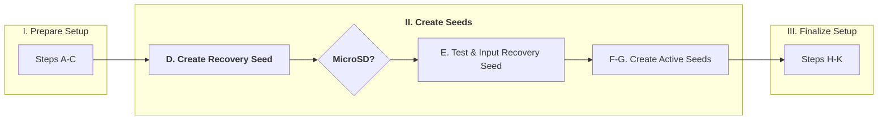

Your recovery seed will be created, printed as SSKR shares, and then deleted. This should _not_ be done on the same device that you will use for your active Gordian Seed Tool key, if at all possible. Do it on an old iPod Touch, an old iPhone, or even an old laptop computer[^15]. Alternatively, use your partner's iPhone temporarily.

1. [  ] Load [Gordian Seed Tool](https://apps.apple.com/us/app/gordian-seed-tool/id1545088229) for MacOS or iOS.
   1. If you prefer, build it yourself from [source](https://github.com/BlockchainCommons/GordianSeedTool-iOS).
1. [  ] Go to the Gear icon, for Preferences, and turn OFF "Sync to iCloud".
1. [  ] Click the "+" and Add a Seed with "Quick Create".
1. [  ] "Save" it.
1. [  ] Print the SSKR for the Seed.
   1. Touch the Seed.
   1. Touch "Authenticate".
   1. Touch "Backup" and Choose "Backup as SSKR Multi-Share".
   1. Choose "2 of 3" and touch "Next"
   1. "Print All Shares", using the defaults for a Summary Page and coupons on individual pages. Be sure you're not printing double-sided!

**Suggested Resilience Improvement: Use MicroSD Cards for SSKR Backup.** The following optional[^16] procedure will increase the resilience of your recovery backup by making an additional copy of your SSKR shares to MicroSD.

1. [  ] Attach Your SD Card Reader for iPhone to Your iPhone
1. [  ] Insert MicroSD Card #1[^18].
1. [  ] In Gordian Seed Tool, again choose your Seed and "Backup" as a "SSKR Multi-Share" of "2 of 3".
   1. If you just printed your SSKR Shares, you're already on the right page.
1. [  ] Choose "Export Shares Individually".
1. [  ] Select to Export Shares as "QR Code"[^17].
1. [  ] Click on the Export Icon for "Share 1".
1. [  ] Scroll down to "Save to Files" and select it.
1. [  ] "Save" the file to your MicroSD Card.
   1. The MicroSD card will typically be on the files list after your iPhone and iCloud, visible as a drive icon.
   1. You will typically want to create a folder, such as "Recovery SSKR" and save to that.
1. [  ] Remove MicroSD Card #1; insert MicroSD Card #2[^18].
1. [  ] Click on the Export Icon for "Share 2"[^19], and export it to your new MicrOSD card, preferably in a folder.
1. [  ] Remove MicroSD Card #2; insert MicroSD Card #3[^18].
1. [  ] Click on the Export Icon for "Share 3"[^19], and export it to your new MicrOSD card, preferably in a folder.

_Any Alternative SSKR Device may be used to replace Steps D + E._

#### **Step E: Test & Input Recovery Seed**

_Default Recovery Device:_ Gordian Seed Tool.

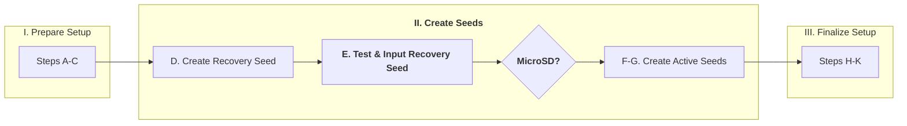

You want to remove the electronic version of your Recovery Seed, but then immediately make sure your SSKR shares are valid.

1. [  ] Delete the Seed in Gordian Seed Tool by either swiping left on it and clicking "Delete" or by touching "Edit", then "-", then "Delete".
1. [  ] Scan in Your SSKR
   1. Select the "QR Scan" icon.
   1. Point it at the QR Code for one SSKR Share.
   1. Point it at the QR Code for another SSKR Share.
   1. The Seed Should Be Restored[^20]. 
1. [  ] Check Your Seed
   1. "Save" The Restored Seed
   1. Touch it to open it.
   1. Does the shortened hex code match?
   1. Does the Lifehash image match?
   1. Do the first one or two words of the name, describing a color, match?[^21]
   1. If anything is wrong, go back to Step D, but that shouldn't happen[^20].
1. [  ] Again, delete your Seed.
1. [  ] Check Your SSKR a Second Time.
   1. Restore your seed a second time, but this time use one of your two previous shares and the one you didn't previously scan.
   1. "Save" it, check it, and delete it.
1. [  ] Check Your SSKR a Third Time[^22].
   1. Restore one more time, this time using the other of your two original shares from that first scan along with the one you didn't originally scan.
   1. In other words, you should have scanned all three combinations of two shares: AB, BC, and AC. If you're confused at which you've used, labeled them "A", "B", and "C".
   1. "Save" it, check it, and this time do *not* delete it (yet).
 
Now that you know you can recover your seed from the recovery shards, you should enter that seed into Sparrow.

1. [  ] Display the Account in Gordian Seed Tool
   1. Select the seed.
   2. Touch "Authenticate"[^23]
   3. Touch "Derive Key" and "Other Key Derivations".
   4. Scroll down to "Secondary Derivation" and Choose "Account Descriptor"
   5. Export the Account Descriptor, which should show an Animated QR.
1. [  ] Input the Account into Sparrow
   1. On Sparrow, Choose "Keystore 1", which should already be selected.
   2. Select "Airgapped Hardware Wallet".
   3. Click the "Scan" button for Gordian Seed Tool
   4. Hold your iPhone desplaying the Cosigner Public Key in front of the camera for your computer running Sparrow.
   5. An xpub of the appropriate key derivation should be imported.
1. [  ] Change the label for Keystore One in Sparrow to be something meaningful like "SSKR Recovery Key"[^25].
1. [  ] Delete the seed on Gordian Seed Tool.[^26]
1. [  ] Delete Gordian Seed Tool.

Finally, you need to divy out your shares, which is how you will recover this seed if you ever need to use it again

1. [  ] Separate and store the shares[^27][^28]. 
   1. Place the overview page and one printed share in your Home Storage.
   1. Place one printed share in your Primary Storage.
   1. Place one printed share in your Secondary Storage.

**Suggested Resilience Improvement: Test MicroSD Cards for SSKR Backup.** If you chose the optional[^16] step of also saving your Recovery Key SSKR shares to MicroSD, you should now check those.

1. [  ] Insert one of your MicroSD cards into your iPhone Reader.
1. [  ] Touch the "QR" button to "Scan" in Gordian Seed Tool and then choose "Files"
1. [  ] Find your SSKR Share of the QR and Select It
   1. You should see "Recover from SSKR" with one of your two shares recovered.
1. [  ] Remove that first MicroSD and Replace It with Another
1. [  ] Find your SSKR Share of the QR and Select It
1. [  ] Verify That Your Seed Has Restored
1. [  ] Best Practice is to Repeat This with the Other Two Potential Combos of Cards
1. [  ] Delete Any Restored Seeds After Testing[^24].
1. [  ] Do *not* yet store your Cards. You'll be using them again in Steps F and G.

_Any Alternative SSKR Device may be used to replace Steps D + E._

#### **Step F: Create & Test Active Seed #1**

_Default Signing Device #1:_ Gordian Seed Tool.

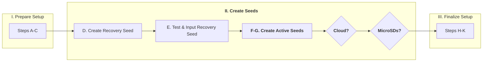

In the default Blockchain Commons scenario, Gordian Seed Tool is used to create and store one of yur active seeds. For optimal security, this Gordian Seed Tool should be on a separate device from the one you used to generate your recovery seed in steps D & E. If you used your partner's iPhone or an old iPhone, or an iPod Touch for your recovery seed, now use your own actively used iPhone for this one.

1. [  ] Load [Gordian Seed Tool](https://apps.apple.com/us/app/gordian-seed-tool/id1545088229) for MacOS or iOS.
   1. If you prefer, build it yourself from [source](https://github.com/BlockchainCommons/GordianSeedTool-iOS).
1. [  ] Click the "+" and Add a Seed with "Coin Flips", "Die Rolls", or "Playing Cards" as you prefer[^29][^30].
   1. Rolling dice is probably the quickest and least tedious method.
   2. Drawing cards can take time because it's done with replacement: reshuffle after each draw.
   3. Flipping coins to generate 128 bits of entropy takes 128 flips. That's a lot!
1. [  ] "Save" it.

You're now ready to read an xpub into Sparrow[^31]:

1. [  ] Display the Account in Gordian Seed Tool
   1. Select the seed.
   2. Touch "Authenticate"[^23]
   3. Touch "Derive Key" and "Other Key Derivations".
   4. Scroll down to "Secondary Derivation" and Choose "Account Descriptor"
   5. Export the Account Descriptor, which should show an Animated QR.
1. [  ] Input the Account into Sparrow
   1. On Sparrow, Choose "Keystore 2", which should already be selected.
   2. Select "Airgapped Hardware Wallet".
   3. Click the "Scan" button for Gordian Seed Tool
   4. Hold your iPhone desplaying the Cosigner Public Key in front of the camera for your computer running Sparrow.
   5. An xpub of the appropriate key derivation should be imported.
1. [  ] Change the label for "Keystone 2" in Sparrow to be something meaningful like "GST Active Key"[^25].

You need to add a few things related to your Apple account to your Storage:

1. [  ] Record your iPhone PIN, your Apple account and password, a PIN to an Apple device, and your Apple recovery code (if you have one) on a piece of waterproof paper.
2. [  ] Store your Apple information at your Primary Storage.

**Optional Resilience Improvement: Store Apple Info in Cloud.** The following optional[^32] procedure will increase the resilience of your recovery backup by storing access info for your Apple account in the cloud

1. [  ] Record your iPhone PIN, your Apple account and password, a PIN to an Apple device, and your Apple recovery code (if you have one) in encrypted cloud storage, such as at LastPass.

**Optional Resilience Improvement: Use MicroSD Cards for SSKR Backup.** The following optional[^32] procedure will increase the resilience of your recovery backup by sharding your active seed from Gordian Seed Tool and saving those SSKRs to MicroSDs[^33].

1. [  ] Attach Your SD Card Reader for iPhone to Your iPhone
1. [  ] Insert MicroSD Card #1[^34].
1. [  ] In Gordian Seed Tool, again choose your Seed and "Backup" as a "SSKR Multi-Share" of "2 of 3".
1. [  ] Choose "Export Shares Individually".
1. [  ] Select to Export Shares as "QR Code"[^17].
1. [  ] Click on the Export Icon for "Share 1".
1. [  ] Scroll down to "Save to Files" and select it.
1. [  ] "Save" the file to your MicroSD Card.
   1. The MicroSD card will typically be on the files list after your iPhone and iCloud, visible as a drive icon.
   1. You will typically want to create a folder, such as "GST Active SSKR" and save to that.
1. [  ] Remove MicroSD Card #1; insert MicroSD Card #2[^33].
1. [  ] Click on the Export Icon for "Share 2"[^19], and export it to your new MicrOSD card, preferably in a folder.
1. [  ] Remove MicroSD Card #2; insert MicroSD Card #3[^33].
1. [  ] Click on the Export Icon for "Share 3"[^19], and export it to your new MicrOSD card, preferably in a folder.
1. [  ] At this point you can store MicroSD Card #1 in your Home Storage.
3. [  ] Do not yet store your MicroSD Cards #2 and #3. You'll be using them again in Step G.

_Any Alternative Signing Device may be used to replace this Step._

#### **Step G: Create & Test Active Seed #2**

_Default Signing Device #2:_ Foundation Devices Passport.

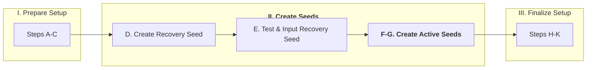

In the default Blockchain Commons scenario, a Foundation Devices Passport is used to create and store one of the seeds.

If you have never before used your Passport, you'll need to set it up:

1. [  ] Open up your Passport, being sure that security seals are all still present[^35].
1. [  ] Power on your Passport by holding down the bottom-left button.
1. [  ] Do the bureaucratic steps.
   1. Call up the setup instructions with the QR.
   2. Agree to the terms of service
1. [  ] Conduct the Supply-Chain Validation[^35].
   1. Scan the Validation Code from the setup instructions.
   2. Copy the four words that appear on your Passport back to the web page.
   3. Verify that the result is a "Success!"
1. [  ] Enter a PIN. 
   1. Start out by entering four numbers.
   2. Note the two words shown; these will be shown any time you enter the start of your PIN, so that you know your Passport has not been compromised or swapped.
   3. Enter at least two more digits and hit the right button to store your PIN.
   4. Verify your PIN.
   5. Record your PIN to a piece of waterproof paper.

It is strongly recommended that you update the firmware on your Passport before you begin using it[^36].

1. [  ] Check your Firmware version on your Passport: v___________.
   1. This can be found at Settings > Firmware > Firmware Version.
1. [  ] Check the current Firmware version on the Setup Page: v____________.
   1. If the Passport Firmware is less than the current Firmware, then continue (otherwise you're done).
1. [  ] Download the current Firmware from the Setup page.
1. [  ] Copy the Firmware to a MicroSD card, using an adapter[^37].
1. [  ] Install the Firmware on your Passport.
   1. Insert the MicroSD card into the top of your Passport.
   1. On your Passport, choose Settings > Firmware > Update Firmware
  
You're now ready to create a new seed on your Passport.

1. [  ] Choose "Create New Seed" on your Passport.
1. [  ] Backup Your Passport
   1. Choose Continue with the right button.
   1. Insert the first MicroSD Card[^38] supplied with the Passport.
   1. Choose Continue with the right button.
   1. Write down the six backup password onto a piece of waterproof paper.
   1. Verify your knowledge of the six words.
1. [  ] Make a second backup
   1. Choose "Yes" to make a second Backup.
   1. Insert the second MicroSD Card[^38] supplied with the Passport.
   1. Choose Continue to make the Backup.

You can now import an account into Sparrow.

1. [  ] Display a Public Cosigner QR for Your Seed on the Passport.
   1. Choose "Pair Wallet" on your Passport.
   1. Choose "Sparrow".
   1. Choose "Multi-Sig". 
   1. Choose "QR Code".
   1. Choose "Continue".
   1. An animated QR Code should be displayed.
1. [  ] Import the QR into Sparrow
   1. On Sparrow, Choose "Keystore 3", which should already be selected.
   2. Select "Airgapped Hardware Wallet".
   3. Click the "Scan" button for Passport Multisig
   4. Hold your iPhone desplaying the Cosigner Public Key in front of the camera for your computer running Sparrow.
   5. If your computer is having problems reading the QR, consider shading it to reduce glare and/or hitting the right button for Resize to display a smaller QR
   6. An xpub of the appropriate key derivation should be imported.
1. [  ] Verify the Seed on Sparrow
   1. Click "Export" on Sparrow.
   1. Select "Show" next to "Passport Multisig".
   1. Scan the animated QR into your Passport
   1. When it gives you the option to create a wallet, click the right-button on your Passport to do so.
   1. On Sparrow, cancel the "Export" and go to "Receive"
   1. Scan the address into your Passport.
   1. This should complete the two-stage verification that your Passport seed has been imported correctly
1. [  ] Update your backups
   1. At this time, your Passport will suggest that you update the backups you just made.
   1. You should do so, so that if your recover from backup, the backups include the Sparrow connection
1. [  ] Change the label for "Keystone 3" in Sparrow to be something meaningful like "FDP Active Key"[^25].

Finally, you need to divy out the various backups and such you made[^39]:

1. [  ] Store your Passport and your listing of the Passport Backup Words in your Home Storage.
1. [  ] Store one Passport MicroSD in your Primary Storage.
1. [  ] Store your written Passport PIN in your Primary Storage.
1. [  ] Store one Passport MicroSD in your Secondary Storage.
1. [  ] If you have access to encrypted cloud storage, such as the "Notes" feature on LastPass, store an extra copy of your Passport Backup Words there as well as your Passport PIN[^41].
1. [  ] Put on your calendar a TODO to "Update MicroSD Storage (Step M)" three years in the future.

_Any Alternative Signing Device may be used to replace this Step._

### PART THREE: FINALIZE SETUP

#### **Step H: Finalize Multisig**

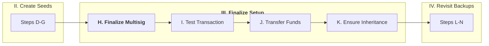

After you have added three keys to Sparrow, either using the defaults of an SSKR Recovery Key and active keys on Passport and GST, or via Alternative Signing Devices, you are ready to finalize your multisig in Sparrow.

1. [  ] Click "Apply"
1. [  ] Choose whether to add a password; you probably should not[^42].
1. [  ] Export your account
   1. Choose "Export".
   1. Click "Export File" next to "Output Descriptor".
1. [  ] Print copies of the Descriptor and save to Home Storage, Primary Storage, and Secondary Storage.
1. [  ] If you have access to encrypted cloud storage, such as the "Notes" feature on LastPass, store a copy of the descriptor there too.

#### **Step I: Test Transaction**

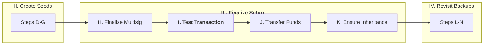

Particularly in the case of a multisig, you want to test your new account by both receiving and then sending back small amounts of funds 

1. [  ] Send funds to your Multisig address from a remote wallet.
   1. Click "Receive" in Sparrow.
   1. Read the address or QR into a remote wallet.
   1. Send a _small_ amount of funds to the multisig address from your remote wallet.
1. [  ] Wait for the funds to arrive.
   1. Click "Transactions" in Sparrow.
   1. Wait for the "Uncomfirmed" funds to have at least one confirmation
1. [  ] Prepare transaction to send funds back to a remote wallet[^43].
   1. Click "Send" in Sparrow.
   1. Copy in an address or read in a QR code.
   1. Add a label; it's required.
   1. Choose an amount to send
   1. Choose a fee based on the priorities shown by Sparrow.
   1. Click "Create Transaction"
   1. Click "Finalize Transaction for Signing".
1. [  ] Sign with your Passport[^43].
   1. Click "Show QR" in Sparrow
   1. Power On your Passport, and sign in with your PIN.
   1. Select "Sign with QR Code".
   1. Hit the right-button on your Passport to review the transaction[^44] and Sign.
   1. Hit "Cancel" on Sparrow to end the "Show QR", then click "Scan QR".
   1. You may need to "Resize" the Passport QR to make it smaller and/or protect the screenf from glare.
   1. You should see a status bar slowly increase as the QR is read in, and eventually the screen should show "FDP Active Key" (or whatever the name) has signed.
1. [  ] Sign with Gordian Seed Tool[^43].
   1. Click "Show QR" in Sparrow
   1. Start up Gordian Seed Tool and hit the "Scan" (QR Code) button
   1. Review the transaction[^44] and "Approve".
   1. Select "QR Code" under "ur:crypto-psbt"
   1. Hit "Cancel" on Sparrow to end the "Show QR", then click "Scan QR".
   1. You should see a status bar quickly increase as the QR is read in, and eventually the screen should show "GST Active Key" (or whatever the name) has signed.
1. [  ] Touch "Broadcast Transmission"[^43]
1. [  ] Wait for the funds to arrive.
   1. Click "Transactions" in Sparrow.
   1. Wait for the "Uncomfirmed" funds to have at least one confirmation.

If you were able to receive and send a transaction, you should feel confident in your new wallet.

#### **Step J: Transfer Funds**

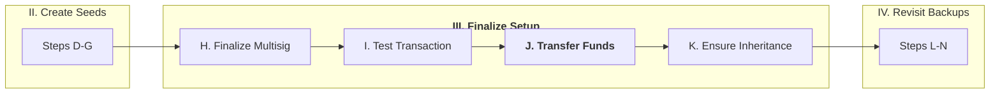

Once you are confident in your control of an account, you can send the rest of your funds to it, preferably in an iterative way as described below.

1. [  ] Send about $10 to your new multisig account.
1. [  ] Wait for it to arrive.
1. [  ] Once it does, multiply the amount that you last sent to the wallet by x10 (e.g., to $100, then $1,000, then $10,000, then $100,000, then $1,000,000).
1. [  ] Repeat the previous two steps until you have sent all the money to your account.

#### **Step K: Ensure Inheritance**

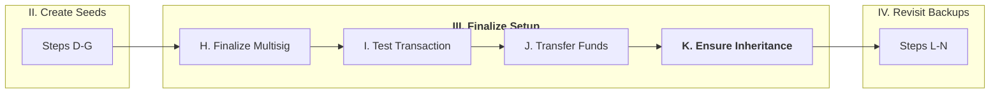

Leaving our assets to our children or other heirs is important for many of us. Digital assets can be hard to find and access, to instructions for your heirs and/or executors will go a long way to ensuring the funds aren't lost.

1. [  ] Prepare a sample letter for your heirs, such as the one found in Appendix III. Choose whether to be specific or vague[^45]. We suggest specific. Be sure to be clear of the scope of the assets if they are large[^46].
1. [  ] Print your letter.
1. [  ] Put copies of your letter in your Home, Primary, and Secondary Storage.

### PART FOUR: REVISIT BACKUPS

#### **Step L: Check Primary Storage (Spring)**

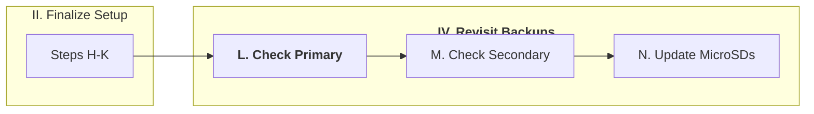

Your digital assets are only protected if you actively maintain your backups. Every Spring you're going to check your Primary Storage.

1. [  ] Collect your Passport, your iPhone, and ideally also a laptop Computer with a MicroSD Adapter. You'll also need a pen.
2. [  ] Visit your Primary Storage.
1. [  ] Make sure your printed SSKR share still exists.
1. [  ] Make sure your printed account descriptor still exists.
1. [  ] Make sure your instructions for heirs still exist.
1. [  ] Check your Apple Information Sheet.
   1. Use the PIN to log into your phone; if you realize it has changed, record the new PIN.
   2. Use the Apple Login & Password to log in to your Apple account; if you realize it has changed, record the new info.
   3. If you recorded an Apple Recovery Code, make sure it's still there and legible.
1. [  ] Check your Passport PIN.
   1. Use the PIN to log into your Passport; if you realize it has changed, record the new PIN.
1. [  ] Backup your Passport[^47].
   1. Choose Settings > Backup > Create Backup
   2. Insert the MicroSD from the Primary Storage into your Passport
   3. Create a New Backup
1. Check your MicroSD on your Computer
   1. If you were able to bring a laptop and MicroSD adapter, insert the MicroSD into the adapter and the adapter into the computer.
   2. Look through the filesystem, make sure that the backups and (optional) SSKR shares are there as expected.

#### **Step M: Check Secondary Storage (Fall)**

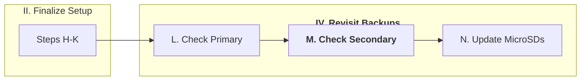

Your Secondary storage may be with friends or family, so Fall is a great time to visit them, and simulataneously check on that online storage as well. (But make sure you do this _every fall_, whether you otherwise plan a visit or not!)

1. [  ] Collect your Passport, your iPhone, and ideally also a laptop Computer with a MicroSD Adapter. You'll also need a pen.
1. [  ] Visit your Secondary Storage.
1. [  ] Make sure your printed SSKR share still exists.
1. [  ] Make sure your printed account descriptor still exists.
1. [  ] Make sure your instructions for heirs still exist.
1. [  ] Backup your Passport[^47].
   1. Choose Settings > Backup > Create Backup
   2. Insert the MicroSD from the Secondary Storage into your Passport
   3. Create a New Backup
1. Check your MicroSD on your Computer
   1. If you were able to bring a laptop and MicroSD adapter, insert the MicroSD into the adapter and the adapter into the computer.
   2. Look through the filesystem, make sure that the backups and (optional) SSKR shares are there as expected.

#### **Step N: Update MicroSDs**

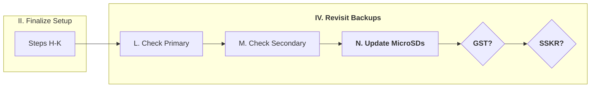

Our current expectation is that MicroSDs have a lifetime of 10 years. But, we're not sure if that's a minimum or actually a median or average. To be safe, we suggest replacing your MicroSD cards every three years. The following process should occur whenever your calendar reminder goes off.

1. [  ] Order two new MicroSD cards (or three if you used the Suggested/Optional Resilience Improvements.)
1. [  ] Bring your Passport to the Primary Storage.
1. [  ] Create a new Backup on the new Card
1. [  ] Store that Card at Primary storage.
1. [  ] Destroy the old Card[^48]
1. [  ] Bring your Passport to the Secondary Storage.
1. [  ] Create a new Backup on the new Card
1. [  ] Store that Card at Secondary Storage.
1. [  ] Destroy the old Card[^48]

**Optional Resilience Improvement: Use MicroSD Cards for SSKR Backup.** 

If you stored your Active Seed from Gordian Seed Tool on MicroSDs, create a new set of shares on the MicroSDs _before_ you go to your Storage, as described in the _Optional_ section of Step F.

**Suggested Resilience Improvement: Use MicroSD Cards for SSKR Backup.** 

If you stored your Recovery Seed on MicroSDs, you should also create a new set of shares on the MicroSDs, but this is slightly tricky because it's currently sharded. Here's the best way to do that!

1. [  ] Grab your partner's iPhone, your iPod, or some other device running Gordian Seed Tool, separate from your main iPhone.
1. [  ] Scan the first Recovery Shard from your Home Storage, as described in Step E.
1. [  ] Leave the scanning _in process_, you'll need to complete it when you get to your Primary Storage.
1. [  ] When you arrive at Primary Storage, scan the second Recovery Shard.
   1. Your Recovery Seed should now be restored to your backup of Gordian Seed Tool.
1. [  ] Shard your Recovery Seed in Gordian Seed Tool, as described in Step D, and output the first share to the MicroSD at your Primary Storage.
1. [  ] Leave the output _in process_, as if you exit Gordian Seed Tool (or exit the SSKR process), the next time it will produce new, incompatible shares.
1. [  ] Output the second share to the MicroSD at your Secondary Storage.
1. [  ] Output the third share to the MicroSD at your Home Storage.

## Options I: Additional Steps

_This section will contain additional steps that may be incorporated into the scenario to better address certain adversaries._

### Optional Step: Use Bags (Fire-Resistant)

**Obstructed Adversary:** Disaster

_This option will describe how to use fire-proof bags to protect paper._

### Optional Step: Use Bags (Fire-Resistant)

**Obstructed Adversary:** Internal Theft, Institutional Theft, Physical Theft (Sophisticated)

_This option will describe how to use tamper-proof bags to protect from theft._

### Optional Step: Use Metal Storage

**Obstructed Adversary:** Disaster, Key Fragility

_This option will describe how to use a metal tile and engraver to protect information._

### Optional Step: Use MicroSDs for SSKR Backup

**Obstructed Adversary:** Key Fragility

_This is already incorporated into the scenario as a strong option._

### Optional Step: Use NFCs for SSKR Backup

**Obstructed Adversary:** Key Fragility

_This option will describe how to use NFCs with Gordian Seed Tool._

## Options II: Alternative Signing Devices

Further discussions of why specific transaction coordinators or signing devices are desirable, or not, may be found in our [#SmartCustody Case Studies](https://github.com/BlockchainCommons/SmartCustody/blob/master/Docs/Case-Studies-Overview.md).

**Signing Devices:**

* [Blockchain Commons Seed Tool](https://github.com/BlockchainCommons/SmartCustody/blob/master/Docs/Case-Study-SeedTool.md)
* [Foundation Devices Passport](https://github.com/BlockchainCommons/SmartCustody/blob/master/Docs/Case-Study-Passport.md)
* Keystone Pro (TBD)

**Transaction Coordinators:**

* [Sparrow Bitcoin Wallet](https://github.com/BlockchainCommons/SmartCustody/blob/master/Docs/Case-Study-Sparrow.md)

  _This procedure is intended to be entirely interoperable, with default choices listed, but the user able to choose to insert other options at his hoice: **Alternative Signing Devices** (described later) offer procedures for using different hardware than our suggestions._

  _**Optional Steps** (described later) may require  purchases of additional items._

### Alternative Recovery Devices

_This will include elements like seed-tool CLI that can produce SSKR shares._

### Alternative Signing Devices

_This will include alternative signing devices such as Keystone and possibly older devices such as Ledger and Trezor_.

_There may need to be some adjustments to the Storage check sections too._

### Alternative Transaction Coordinators

_This may require new scenarios to fully lay out._

## Appendix I: Gordian Principles & Adversaries

This #SmartCustody procedure is intended to highlight the [Gordian Principles](https://github.com/BlockchainCommons/Gordian#gordian-principles) and address many [adversaries](https://www.smartcustody.com/) from #SmartCustody. Here's how it does so.

### Gordian Principles

* **Independence.** This multisig procedure is _self-sovereign_. You retain control of your keys and thus your finances.
* **Privacy.** Though obviously maintaining your own keys helps with your privacy, much of the issue relates to how you conduct transactions on the network, which is beyond the scope of this document. See the [Sparrow case study](https://github.com/BlockchainCommons/SmartCustody/blob/master/Docs/Case-Study-Sparrow.md#privacy) for more on how that transaction coordinator manages Privacy, and particularly consider what Bitcoin server you are using: a personal server will be more private than a public server.
* **Resilience.** The focus of #SmartCustody is on the resilience principle, so this procedure demonstrates how to minimize both SPOCs and SPOFs for your self-sovereign cryptocurrency usage. See the next Appendix for more.
* **Openness.** The modularity of this scenario is intended to create openness, so that you can make your own choice of any signing devices. Though we offer default assumptions, the procedure is written so that other devices can easily be slotted in. (We'd likeyou to be able to choose your own transaction coordinator too, but that's a bit harder to modularize since it runs through the entire procedure.

### Adversaries

The heart of #SmartCustody is a discussion of Adversaries that can oppose the Gordian Principles (especially resilience). Here's a complete listing of those, and how this procedure addresses them (or not).

1.  **Loss by Acts of God**
   * *Adversary: Death / Incapacitation* — The instruction for heirs ensure that your digital assets remain available to heirs and executors.
   * *Adversary: Denial of Access* — Having a 2 of 3 multisig means the denial of access to a single locale doesn't prevent access to your assets.
   * *Adversary: Disaster* — If the keys (and SSKR shares) for your funds are well-separated, they will be largely proof against disasters. As our notes say, geographic separation can be more important than physical security.
2.  **Loss by Computer Error**
   * *Adversary: Bitrot* — Your account descriptor ensure that you aren't subject to Sparrow Bitrot, and your storage of a recovery key as shares in a standardized format (SSKR) similarly protects that key. The Gordian Seed Tool and Passport keys are somewhat more subject to Bitrot, as the programs could go away, but Gordian Seed Tool is open source and Passport keeps its backups in a well-understand 7zip format, so those should always be retrievable as well. Backing up your Gordian Seed Tool key as shares, per the resilience option, further decreases any Bitrot danger.
   * *Adversary: Systemic Key Compromise* — If the full procedure is used, including using two different methods to generate Gordian Seed Tool keys, the overall account should be proof against Systemic Key Compromise, because at worst 1 of 3 keys would be compromised at any time.
3.  **Loss by Crime, Theft**
   * *Adversary: Institutional Theft* — The joy of self-sovereign control of assets is that you don't have to trust an institution.
   * *Adversary: Internal Theft* — Theoretically, revealing information about your digital assets to your heirs does create a threat of internal theft. However, as long as you maintain sole control over the locales with at least two of the keys, your assets should remain protected. Nonetheless, be aware of the potential issue.
   * *Adversary: Network Attack, Personal* — None of your keys are online, so the only network attack surface is your network coordinator. This simply means that you need to carefully review the details of any PSBTs that you sign with your airgapped signing devices.
   * *Adversary: Network Attack, Systemic* — By avoiding the use of exchanges or other online services, you entirely protect yourself from more systemic attacks.
   * *Adversary: Physical Theft, Casual* — A casual theft will have no effect: you lose one key (but probably have a backup) and the thief gets one key (which is insufficient).
   * *Adversary: Physical Theft, Sophisticated* — For a sophisticated theft to work would require knowledge of the location of multiple keys and their simultaneous theft. A much more likely situation would be a thief stealing one key and your instructions to heirs and then making plans to steal the others: which means that you have to regularly check your storage locales and immediately sweep funds to new keys if a theft occurs.
   * *Adversary: Social Engineering* — There is no proof against social engineering. So, you still need to be careful.
   * *Adversary: Supply-Chain Attack*] — Using the default scenario, your Passport is well protected against Supply-Chain Attack, but an iPhone could be more vulnerable. This is another reason that it's important to use two different iDevices for your active and recovery key. You can reduce the danger of a supply-chain attack by buying directly from an Apple Store.
4.  **Loss by Crime, Other Attacks**
   * *Adversary: Blackmail* — Blackmail isn't as immediate as coercion, but remains something not well controlled by a cryptocurrency procedure.
   * *Adversary: Coercion* — Coercion is generally a social threat that can't be controlled by a cryptocurrency procedure. Not linking your cryptocurrency to a real-world identity is one of the best solutions.
   * *Adversary: Non-Financially Motivated Attackers* — Funds are well protected against theft of any sort, so a non-financially motivated attack is unlikely to succeed.
   * *Adversary: Terrorist / Mob* — This is another variation of coercion, subject to those dangers.
5.  **Loss by Government**
   * *Adversary: Legal Forfeiture* — There is no attempt made to protect assets from legal action.
   * *Adversary: Nation-State Actor* — This scenario assumes a first-world government that is not a threat, though a self-sovereign scenario such as this would provide good protection against a rogue government, if the assets were kept secret.
6.  **Loss by Mistakes**
   * *Adversary: Convenience* — There is certainly some friction built into the scenario, such as the need to occasionally replace MicroSDs, and the suggestion to keep keys in widely separated locations. Giving in to convenience by ignoring some of the core tenets of the procedure could dramatically reduce is usefulness and protections.
   * *Adversary: Key Fragility* — This procedure dramatically reduces the possibility of accidental key lost _provided_ that funds are swept forward immediately if one key is ever misplaced.
   * *Adversary: Process Fatigue* — As noted under Convenience, there is some real possibility for Process Fatigue, particularly in the semi-yearly checks. The actual usage of two devices to sign PSBTs is quite fast and simple, and should not cause process fatigue itself.
   * *Adversary: Transaction Error* — Errors in fees or amounts sent are increasingly not an issue when using modern transaction coordinators such as Sparrow and modern signing devices (which repeat information about a transaction).
   * *Adversary: User Error* — Obviously, user error is always an issue, but the existance of an extra key and the usage of modern transaction coordinators and signing devices minimizes that.
7.  **Privacy-related Problems**
   * *Adversary: Censorship* — The biggest danger of censorship lies in sending transactions, and the Sparrow transaction coordinator makes it very easy to send via a variety of means.
   * *Adversary: Correlation* — If desired, a user could maintain an additional warm wallet in the Sparrow transaction coordinator to allow use of CoinJoin to foil any correlation.
   * *Adversary: Loss of Fungibility* — CoinJoin can also foil problems of loss of fungibility.

## Appendix II: SPOFs & SPOCs in This Scenario

The original #SmartCustody single-sig scenario ensured that there were no Single Points of Failure (SPOFs) where the loss of devices and data at a single site could result in the loss of digital funds. This multi-sig expands on that by also ensuring that there are no Single Points of Compromise (SPOCs) where the theft of devices and data at a single site could result in the loss of digital funds.

Following are discussions of potential fail modes and how this scenario avoids them.

### Single Points of Failure (SPOF)

**Loss of Individual Data:**

Loss of individual data causes no asset loss because of careful storage in locales.

1. **Lost Apple ID.** The Apple account can be recovered using the data stored at the Primary Storage. 
1. **Forgot Passport PIN.** The Passport PIN at the Secondary Storage may be used to access the Passport. 
1. **Forgot Passport Backup Words.** This is not an issue unless the Passport is lost from Home Storage. Optionally, Backup Words can be stored in Cloud storage and restored to Home Storage if lost. If there is a loss, new backups should be made immediately, with new Backup Words. 

This makes the locales the ultimate measure for SPOF.

**Loss of Individual Locale:**

Loss of individual locales results in no loss of assets[^A1]:

1. **Loss of Home.** New phone can be rebuilt with login info at Primary Storage; ideally new Passport is loaded with MicroSD at Primary Storage and Passport Backup Words from Cloud, but if Backup Words are not available, instead: Recovery Key is rebuilt from  SSKR Shares at Primary and Secondary Storage.
1. **Loss of Primary.** Passport and Gordian Seed Tool remain available at home.
1. **Loss of Second.** Passport and Gordian Seed Tool remain available at home.

**Loss of Multiple Locales:**

Loss of multiple sites can cause asset loss, depending on how much optional resilience was used:

1. **Loss of Home + Primary.** The only things left are a MicroSD at Secondary Storage and whatever's in the Cloud. Recovery is only possible if care was taken in backing up access info to the cloud. If the user has the Passport Backup Words in the Cloud and if they have Apple login information somewhere such as Lastpass, and if they know the PIN to a previous apple device, then they can restore one seed off the MicroSD at the Secondary Storage and another from iCloud. But without optional Cloud backup, the assets are lost.
1. **Loss of Home + Secondary.** The Passport MicroSD at Primary Storage may be used to recover a seed provided Passport Backup Words were put in Cloud; Gordian Seed Tool can be rebuilt from iCloud, possibly requiring login information at Primary Storage. If the Passport Backup Words were not backed up to the Cloud, and they are not known, the assets are lost.
1. **Loss of Primary + Secondary.** Passport and Gordian Seed Tool remain available at home.
1. **Loss of Home, Primary Storage, and Secondary Storage.** One key may still remain available in iCloud, if Gordian Seed Tool can be rebuilt, but that's insufficient to sign multisigs: the assets are definitely lost.

**KEY LOSS BY LOCATION LOSS**
| What's Lost? | Also ... Home | Primary | Secondary |
| :--- | :--- | :--- | :--- |
| Home | :green_square: Rebuild Passport (Cloud Dependent) & iPhone; or Rebuild iPhone and Restore SSKR | :yellow_square: Rebuild Passport (Cloud Dependent) & iPhone (Cloud Dependent) | :yellow_square: Rebuild Passport (Cloud Dependent) & iPhone |
| Primary | yellow_square: Rebuild iPhone & Passport (Cloud Dependent) | :green_square: Recreate Backups | :green_square: Recreate Backups |
| Secondary | :yellow_square: Rebuild Passport (Cloud Dependent) & iPhone | :green_square: Recreate Backups |:green_square: Recreate Backups | 

TRIPLE LOSS: :red_square: LOSS! Only Gordian Seed Tool Potentially Remains

_Note that the SSKR shares are usually not needed, except in the Home Loss scenario. They may also come into play for a loss of some material at a location, such as if the iPhone is lost along with the Primary Storage, which contains backup information. Nonetheless, they're important to ensure that the scenario remains robust for this sort of situation._

### Single Points of Compromise (SPOC)

SPOF and SPOC inevitably lie in balance. The more SPOF is reduced, the greater SPOC is increased. Since this scenario does its best to minimize, it does have some vulnerability to SPOC, but it has been designed so that two locales must be attacked to provide an attacker with sufficient key material to create a compromise. This underlines the importance of separating locales where material is stored.

Here's the key material loss in each situation:

* **Theft at Home:** No key material: locked iPhone, locked Passport, 1 recovery share.
* **Theft at Primary:** No key material: locked Passport Backup.
* **Theft at Secondary:** No key material: locked Passport Backup.
* **Theft at Home + Primary:** 3 keys: iPhone + PIN; Passport + PIN; 2 recovery shares.
* **Theft at Home + Secondary:** 2 keys: locked iPhone; locked Passport; Passport Backup + Words; 2 recovery shares.
* **Theft at Primary + Secondary:** 1.5 keys: locked Passport Backup; potential to highjack Apple account; 2 recovery shares.

The addition of an optional cloud adds very little danger, except in the situation where both Home and Cloud are compromised (which means: don't make your cloud login information available at home, or you're creating a SPOC.)

* **Cloud:** .5 keys: potential to highjack Apple account.
* **Home + Cloud:** 2 keys: unlocked iPhone, unlocked Passport, 1 recovery share.
* **Primary + Cloud:** .5 keys: potential to highjack Apple account.
* **Secondary + Cloud:** .5 keys: potential to highjack Apple account.

**KEY THEFT BY LOCATION COMPROMISE**
| Where's Compromised? | Also ... Home | Primary | Secondary | Cloud | 
| :--- | :--- | :--- | :--- | :--- | 
| Home | :green_square: OK | :red_square: 3 keys | :red_square: 2 keys | :red_square: 2 keys | 
| Primary | :red_square: 3 keys | :green_square: OK | :yellow_square: 1.5 keys | :green_square: .5 keys |
| Secondary | :red_square: 2 keys | :yellow_square: 1.5 keys |:green_square: OK |  :green_square: .5 keys |
| Cloud | :red_square: 2 keys | :green_square: .5 keys | :green_square: .5 keys | :green_square: OK |

## Appendix III: Preserving Assets for Your Heirs

Being able to pass assets down to heirs is important for many. But, even if you don't have any heirs, making your funds available to someone else, whether it be a spouse or a lawyer, can be crucially important: if you are disabled to the point where you are unable to access your funds yourself, you may _need_ someone to access your funds for you, quite possibly to pay for the medical care that you need.

Ensuring that heirs, spouses, or lawyers can access digital access runs afoul of three large problems:

1. **The Invisibility of Digital Assets.** It's relatively easy to discover most physical assets, but because of their decentralization, no one is ever going to contact an heir about digital assets and why they're not being used.
2. **The Lack of Authorities.** Because many digital assets, including cryptocurrencies, are self-sovereign, there's no one to unlock funds. Instead, that can only be done with control of private keys, which themselves may be locked by PINs, passwords, or biometrics. Information on this authentication information must be left to heirs, but it also must be done in a way that the funds can't be stolen.
3. **The Difficulty of Access.** Accessing digital assets can be a pain if someone is not familiar with the process. This itself can cause loss, especially if heirs don't realize the value of the assets.

This scenario has been set up to minimize the possiblity of losing your authentication tokens, but you must still: reveal assets to heirs; tell them how to access them; and underline their value. That's what a letter does, which is why one of those is included in the scenario as well.

## Appendix IV: Sample Letter to Heirs

```
Dear _________________,

This letter is meant to alert you that I have digital cryptocurrency assets that as of ____________ have a value of approximately ___________________.

This includes:

____________________________________________________
____________________________________________________
____________________________________________________
____________________________________________________
____________________________________________________
____________________________________________________

My cryptocurrency is protected by a 2-of-3 multisig. That means that it can be recovered by accessing the correct cryptocurrency account and unlocking it with two of my three keys. I suggest you consult __________________________________________ as someone who I trust and who is knowledgeable with cryptocurrencies. You will need to either access my exchange login or create a new one with a cryptocurrency exchange, send the money to that exchange using my multisig keys, and then withdraw it to a normal bank account.

My keys can be retrieved as follows:

Key #1 
Kept In ________________________
Stored at _________________________
Access Info ________________________

Key #2 
Kept In ________________________
Stored at _________________________
Access Info ________________________

Key #3 
Kept In ________________________
Stored at _________________________
Access Info ________________________

Once you have the keys you can apply them in the account which can be found as follows:

Account
Kept In _____________________
Run On ______________________
Access Info __________________

Again, if this is foreign to you _________________ will be able to help. I suggest you consult with them before trying to move any funds.

Love,

________________________
```

This form should _not_ contain the access info, as doing so would create a SPOC. Instead, it should highlight the places where your information is stored. If you are using this scenario, it would look something like this:

```
Key #1 
Kept In: Passport Hardware Wallet
Stored at: Home Safe
Access Info: PIN is at Safety Deposit Box

Key #2 
Kept In: Gordian Seed Tool
Stored at: My iPhone
Access Info: PIN is at Safety Deposit Box

Key #3 
Kept In: Sharded Shares
Stored at: Home Safe, Safety Deposit Box, Mom's House (you only need 2)
Access Info: Scan them into Gordian Seed Tool on _your_ iPhone

Account
Kept In: Sparrow
Run On: Old Laptop Computer (MacBook Air 2017 model)
Access Info: Password is at Safety Deposit Box
```


---

[^1]: **What about the Wallets?** The term "wallet" has generally been horribly overloaded in the digital-asset space. Worse, the language discourages thinking about functional partition of different elements — such as partitioning key signing from transaction creation. This scenario thus avoids the term wallet, replacing its traditional usage with "transaction coordinator" and "signing device". The transaction coordinator is the software that creates transactions, manages signing, and sends the transaction. It's typically internet connected. The software used in this scenario is typically called the "Sparrow wallet", or a "software wallet", but it doesn't hold any keys in this example: it's a pure coordinator. Signing devices sign transactions that they're given, usually because they hold keys. The majority of signing devices, such as Ledger, Trezor, Keystone, and Passport have typically been called "hardware wallets".

[^sca]: **Supply-Chain Attacks.** When possible, buy your products directly from the manufacturers, preferably at a store you can walk into. Thus, for example, it's optimal to buy an iPhone directly from the Apple Store. This directly reduces the odds that someone has modified the device before you received it. To reduce privacy dangers, you can also choose to pay for items with cash, a pre-loaded debit card, or some other means that keeps your personal information separate from the purchase.

[^2]: **Separating Keys.** This multisig scenario suggests the use of three keys, any two of which can be combined to use funds. A basic rule of thumb is to _never_ place seeds on the same device or network, because doing so turns it into a SPOC where a compromise of that network or device could then compromise your multisig, and thus your assets. Thus, though this scenario suggests the use of Gordian Seed Tool to create two different seeds, one active and one as a backup, they should _not_ be done on the same device. For the permanent key, we suggest use of your personal iPhone or else a brand-new iPod Touch, to make it optimally accessible and also optimally protected. For your recovery key, we suggest you use an older iPod Touch or even borrow a trusted partner's iPhone; you'll be deleting that key after you create it. In a pinch, you _could_ use the same iPhone or iPod Touch for both creating a recovery key and holding an active key, provided you were careful about deleting the recovery key, per the scenario instructions. However, if you're holding any notable funds, it's better to invest some money at the start to do this right: using the same device for two seeds, even chronologically separated, creates a SPOC.

[^3]: **Signing Device Generations.** First-generation signing devices tended to focus on support for single-sig addresses and tended to be direct-connected devices. The original [Ledger](https://www.ledger.com/) and [Trezor](https://trezor.io/) both fit into that category. The [Coldcard](https://coldcard.com/) was transitional, offering some of the first options to connect across airgaps, with a MicroSD slot, while still maintaining the port-connection paradigm. Second-generation signing devices are fully airgapped, with no ability to directly connect them to other devices. They transmit data via QR codes or MicroSD cards. the [Foundation Devices Passport](https://foundationdevices.com/passport/details/) and the [Keystone Pro](https://keyst.one/) are both second-generation signing devices. 

[^4]: **Why Airgaps?** Optimal safety of a seed means ensuring that the device holding the key can't be corrupted and that the seed (or even hints about the seed) can't slip off the device. Any type of live connection can be dangerous, because even if a stream is purely intended for data, a buffer overflow or other error might send return data back across the connection without intervention of the users. Airgaps not only ensure data is in the maximally constrained form, thanks to use of a QR code or a MicroSD data file, but they also ensure that the user can see any data that's being sent back in return, and OK that sending or not. Of course, this also depends on airgapped devices being very precise and complete in revealing what data they receive and what data they send.

[^5]: **Why Passport and Seed Tool?** We choose Passport and Gordian Seed Tool as second-generation signing devices that have fully integrated backup mechanisms: Passport to MicroSD, Seed Tool to iCloud. We've thus combined the protection against SPOC implicit in an airgapped design  with the protection against SPOF supported by a backup that the user doesn't have to think (much) about. Caveats: Foundation Devices is a patron of Blockchain Commons. This likely impacted our familiarity with the device, but didn't impact our decision to choose it as the best signing device for this scenario. The Gordian Seed Tool is a reference app created by Blockchain Commons.

[^6]: **Locale Security.** Obviously, the more secure locations are, the better. Optimal setup would be to have a robust Home Safe and two safety deposit boxes in banks in two widely separated locales. However, we expect most people will choose their locales as home, bank, and work; or else as home, work, and family/friend home. The most important factor for the overall security of your scenario may not be physical security of the locale, but instead geographical separation, ensuring that no single disaster such as an earthquake or wildfire and no single event such as a war or civil unrest, could easily compromise two locales.

[^7]: **Why Isn't Security the Biggest Factor?** No single locale should have enough information to access your funds in an unlocked way. Your home is the biggest danger because it holds two keys, but they should both be locked, either by PIN or biometrics. Each other locale holds at most one and a third keys, the full key locked.

[^8]: **Safe Usage.** Note that most home safes do not offer enough [Disaster](#adversary-disaster) resistance to sufficiently protect your digital assets. At best they are rated to protect paper against fire. The primary goal of a home safe is to protect any Signing Device kept at home that is not in active use and to store one share of your SSKR, so that neither can easily be lost or stolen. Stealing would likely not compromise your funds, but it would put you on the path to losing control of those funds if disaster struck another locale.

[^9]: **Safe Optional.** The use of a safe is somewhat optional: you will have enough seeds at home to compromise your funds, but they should each be locked by PINs or biometrics, making such compromise unlikely. It's recommended, and it's better to have it, but don't give up on this procedure just because you don't have a home safe. 

[^10]: **Computer Choices.** Everything's a balance. If you can choose a computer that doesn't get much use, that's more secure, but you also want to make sure that it's a computer that will stay up to date with security updates. If the computer is no longer being supported with security updates, that's a bad choice. The biggest danger if your computer is compromised is that your transaction coordinator may be compromised and it will send you incorrect PSBTs for signing. So _always_ look carefully at any PSBTs that you're signing, and be even more careful if your computer is less secure through other usage.

[^11]: **Software Verification.** It can be tempting to skip over this verification step. **Don't.** A supply-chain attack is a real adversary: the software may have been changed on the website. But, if so, it won't match the checksum or the checksum won't be signed by the correct creator. So, be sure to verify and be sure to carefully consider the results.

[^12]: **New Wallet.** As we said, the term "wallet" is overloaded. Here, "New Wallet" really means a "new account", which is to say a group of addresses.

[^13]: **Account Naming.** Choose an intuitive, obvious name, like "Multisig" or "Passport and Seed Tool Multisig" or "LLC Multisig". Security by obscurity *isn't*, and worse, it's only likely to mess you or your heirs up.

[^14]: **Script Type.** Current options are "Legacy", "Nested Segwit", and "Native Segwit". Both "Legacy" and "Nested Segwit" are older Bitcoin scripts, while "Native Segwit" has been the current one for several years. It's always best to stick with the newest, to future-proof your funds, as long as it's been around for a year or two and is a mature technology.

[^15]: **Computer or Mobile Device?** Generally, a mobile device is preferred over a computer because it reduces the attack surface. If you do choose to use a computer for creating your recovery key, be sure it's not the computer also running Sparrow. Generally, keep your keys and your transaction coordinator separate, or you begin to lose the advantages of this scenario.

[^16]: **Why Optional?** We encourage everyone to create MicroSD backups of their SSKR shares, as described here. The _only_ reason that this is listed as optional is because we don't want to discourage you from using this procedure if you don't have an SD Card Reader for iPhone and an extra MicroSD card on hand. So, if you can, get that Card Reader and that extra card. If you don't have them, just skip these parts, but we suggest that you come back and do them in the future.

[^17]: **Why QR?** We choose QR as the most automated of the restore methods. You should be able to display two of the three QRs from these files (or load them directly in Seed Tool) and restore in a totally automated way. However, if you prefer to be able to see your backup words, choose ByteWords. Even better, backup in both formats.

[^18]: **Which Card Is Which?** If you're using our standard procedure MicroSD Card #1 is the one you bought with the SD Adapter, while MicroSD Card #2 and #3 are the ones that came with your Passport. If you're using a Passport, it's important to differentiate them, because you will _not_ put a Passport backup on MicroSD Card #1, as it'll be stored the same place as the Passport Backup words.

[^19]: **Export Together!** One you have clicked the "Export Shares Individually" button do *not* click done until you have exported all three shares. Each times SSKR shares are generated, they're modified by new entropy. That means that SSKR shares may only be used with the other shares created at the exact same time.

[^20]: **No Restore?** If it didn't restore, you have a problem. You're probably going to need to go back to Step D and create a new seed. But this really shouldn't happen.

[^21]: **OIB Name.** The Object Identity Block name has one or two words that describe the color of the Lifehash and two words that are random. So the last two words _will_ change. That's expected. The color words should _not_ change, but since they are not a standard, they could in rare cases, but if so they'd shift to a very similar description, such as from "Yinmn Blue" to "Dark Purple".

[^22]: **Tedious Rechecks.** Tedious double- and triple-checking keeps your assets safe. And really, it should only take a minute to run through all three combinations of your shares.

[^23]: **Authenticate?** Needing to authenticate suggests that you're passing private information, but `ur:crypto-account`[^24] and its `ur:crypto-outputs` are [defined](https://github.com/BlockchainCommons/Research/blob/master/papers/bcr-2020-015-account.md) to only pass public-key info. So why is authentication required? Because they're derived from the master private key.

[^24]: **Why Crypto Account?** A crypto-account includes outputs of descriptors for a number of different key derivations. It allows Gordian Seed Tool to output a single packet of information and for the recipient to pull the specific derivation that they need (in this case, a cosigner key). So, it minimizes user errors when passing over xpubs. But, our preferred solution if for the recipient to make a `ur:crypto-request` for exactly what they need and Gordian Seed Tool to use a `ur:crypto-request` to send it.

[^25]: **Clear Labelling.** No security through obscurity.

[^26]: **Seriously, Delete It!** It is very important that your recovery seed *not* be in Gordian Seed Tool as it creates an additional vector of action. This is especially important if you are using the same devie for your recovery seed and your active Gordian Seed Tool (not recommended!).

[^27]: **Separating Shares.** Part of this scenario ensures that there are no Single Points of Compromise (SPOCs) for your funds by ensuring that none of the keys are ever left unprotected, But, your set of three SSKR shares represents an unprotected key when any two are put together. So, you need to immediately divide them up, as planned. Don't Dela! 

[^28]: **SSKR Security.** Remember that no one can do anything with these shares unless they have two of them, so even if you have to just give one to a friend, that's probably fine. They'd need a second one to have your key, and even then they'd need a second key to access your funds.

[^29]: **Why Dice, Coins, and Cards?** One of the potential adversaries for digital assets is "Systemic Key Compromise", where the methodology for creating a key was wrong. We don't want the key-generation process to be a SPOC, and since you used "Quick Create" for your recovery key, that means you should use a different methodology for creating the active key that you're going to use in Gordian Seed Tool.

[^30]: **Do It Right!** Rolling dice, picking cards, and especially flipping coins can be tedious, but do it right! Actually engage in the activity until you have 128 bits of entropy. Do not just randomly hit buttons: that won't be random. If you're not going to correctly feed in the entropy from those dice, cards, or coins, you might as well just "Quick Create".

[^31]: **Don't Delete!** Note that unlike with the recovery key, you're not deleting either this key or Gordian Seed Tool on this device. This is one of your two active keys; it's what you'll regularly use to spend funds on your account.

[^32]: **More Optional.** This is more optional than the previous reslience options. In fact, it may even be a trade-off. As is, you've got your active Gordian Seed Tool seed in two places: on your iPhone and in iCloud. So why back it up further? Because Apple could disappear. Because you could lose access to your Apple account. Because you could forget PINs to old Apple computers when you try to load a new one. And, if you've already got a trio of MicroSDs from the previous resilience options, this is easy to do. Why not do it? Because you're putting enough data on the MicroSD cards that any two of them could be used to compromise your account, without additional passwords. So, if you think it's more likely that Apple or your Apple account disappear, do this! If you think it's more likely a pair of MicroSDs cards are compromised, don't. SmartCustody is all about analyzing which risks are most likely to affect *you*.

[^33]: **No Printing.** Do *not* create SSKR shares for your active GST seed by printing them, or at the last, not on the same network you printed the previous ones. If that network is compromised, an attacker can now empty your Bitcoin account.

[^34]: **Which Card is Which (II)?** All that matters it that you continue to track which cards will not have the Passport backup, because that's the one to store with the backup words.

[^35]: **Supply-Chain Attack.** This is all fighting against the "Supply-Chain Attack" adversary, where the threat is that someone tampers with the device somewhere in the supply chain, between Foundation Devices shipping it out and you receiving it. The attacker could be a retailer, distributor, or someone in the postal system, depending on how you acquired your Passport. If your device were tampered with, it might supply a static seed that an attacker knows about or damage your security in any of a number of other ways.

[^36]: **Why Upgrade?** You always want every piece of software and hardware you use to be the most up-to-date before you put digital assets on it. Older versions might have flaws or compromises that could lead to the loss of assets. So, even though it takes some real effort to upgrade your Passport, you should do so.

[^37]: **MicroSDs & SDs.** A MicroSD card is about the size of a fingernail. It can fit in your Passport, your iPhone and other small devices. An SD card is about the size of your thumb. That's the size more typically used for computers. In order to use a MicroSD card on a computer, you'll typically need an [adapter](https://www.amazon.com/gp/product/B08K8H6Q6T/ref=ppx_yo_dt_b_search_asin_title?ie=UTF8&psc=1), which is the size of an SD card. That'll let you read and write the MicroSD on your computer. You then remove the MicroSD card from the adapter, and you can use it with your Passport. 

[^38]: **Which Card is Which? (Redux).** These two cards are the two that came with your Passport. If you are using the "Suggested Resilience Improvement" of this Scenario, where you also back up SSKR shares to MicroSD cards[^18], you will _not_ make a backup to the extra card you have, because that one is going to be stored with a copy of your backup words.

[^39]: **Dividing Passport Assets.** If it's not obvious, the Passport assets are divided such that no storage unit becoems a single-point-of-compromise _for that key_. So, your Passport Backup Words are stored at Home because you don't keep either of your Passport Backups there. Thus, a thief would either (at home) get your Passport (which requires your PIN) and your Passport Backup Words (which require a Backup), and each of those are worthless on their own. Similarly, a thief at your Primary Storage would get your PIN (which requires your Passport) and a Backup (which requires the Passport Backup Words), and again each would be worthless on their own. If you are using Suggested Resilience Option, things are very slightly more complex[^40].

[^40]: **Dividing Other Assets.** With the suggested and optional resilience options, you also put SSKR shares onto the Passport MicroSDs, as well as a third MicroSD. Again, those are safe from SPOC because two shares are required to make a key. But you have to be careful to make sure that one of the MicroSDs _doesn't_ contain a Passport backup, and that it's the MicroSD you keep in Home Storage, because that's where the Passport Backup Words are!

[^41]: **Cloud Words.** The Passport Backup Words are probably the scariest Single Point of Failure in this whole scenario. As noted in Appendix I, there are situations where a dual-loss can result in the loss of your assets if you don't have a cloud backup of your words, but you can save them if you do. If you have any large amount of funds you should _ensure_ that your Passport Backup Words and preferably your PIN as well are doubled-up in some secure storage, such as the encrypted cloud.

[^42]: **Why No Password?** Every time you add a password to your system, you add a new SPOF (Single Point of Failure). In this case, all you'd be protecting is a watch-only wallet, which could compromise your privacy, but not your digital assets, so it's not worth it unless you have strong reasons for privacy protection.

[^43]: **Sending Funds.** This procedure can be used whenever you want to send funds from your wallet.

[^44]: **Review the Transaction.** _Never_ treat this as a rubber stamp. Always look carefully at all data shown by your signing device, including how much is being sent and where. This is your main defense against a man-in-the-middle attack or corruption of Sparrow.

[^45]: **Specific or Vague?** When you are writing your letter to your heirs, you can be either very specific, listing exactly how they can access your funds, and where all the puzzle pieces to do so are; or you can be vague, saying what they'll need but not where they are. Being specific means that a thief breaking into any of your storage then has a blueprint for where the rest are and how to access your digital assets. Though there's still no Single Point of Compromise, there's now a Single Blueprint of Compromise. Being vague means that your heirs might fail to access your funds if they don't know where all the pieces might be kept. There _are_ compromises, for example if your Primary Storage is your Bank Safety Deposit Box and your Secondary Storage is a locked drawer at your work, you could choose to be really specific by naming the bank and the place of work, or you could be only somewhat vague and say "bank" and "work". Ultimately, you need to decide whether theft or loss is more liekly and plan accordingly. Our general analysis is accidental loss is a lot more common than individual theft, and so we suggest moving toward the "specific" side of the equation.

[^46]: **Funds Scope.** If you have a lot of assets, be sure your heirs know that. Retrieving your digital assets is going to be time consuming and alien to most people. It might be ignored if your heirs don't think it's worthwhile. So, be sure to let them know if it is!

[^47]: **Why Backup?** Pragmatically, it's good to always make sure your backup is up-to-date. But, we also don't have a lot of data on the longevity of MicroSD cards. Our current belief is that they last 10 years (but is that a median, an average, a minimum? we're not sure) and that they remain fresher if exercised. So, every year you make sure you read and write to your card. And every three years, you replace it.

[^48]: **Destroying MicroSD Cards.** We like scissors. See [How to Destroy a Memory Card](https://www.askcybersecurity.com/how-to-destroy-memory-card/) for more.

[^A1]: **Locale Lossage.** The biggest danger to resilience is ignoring the loss of a single locale. There are no SPOFs for locations, so it's OK if you suddenly find your Primary Storage or even your Home unavialable. Potential problems arise when a second locale loss stacks atop the first one. That means: if you lose a single locale, you should immediately replace it as a top priority.

[^A2]: **Access Lossage.** Similar, if you lose a single piece of data, such as access to your Apple account, you must immediately rectify that before a second loss stacks atop it, resulting in much more serious consequences.
